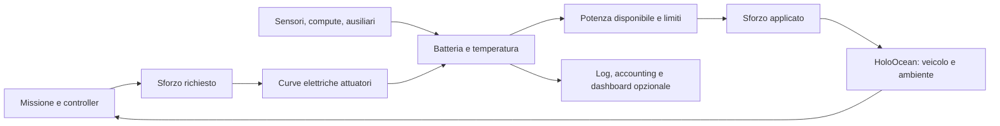

# HoloEnergy

HoloEnergy is a configurable energy-aware simulation framework for marine robots
integrated with HoloOcean. BlueROV2 Heavy is provided as the first reference
hardware profile and experimental validation platform.

Il framework collega sforzo degli attuatori, carichi elettrici, batteria,
temperatura e potenza disponibile. ROV, AUV e veicoli custom usano la stessa API;
il supporto USV dipende dal contratto di controllo del backend.

## What is HoloEnergy?

Il consumo propulsivo deriva dagli **sforzi richiesti agli attuatori**. Un veicolo
fermo che contrasta una corrente può consumare energia. HoloOcean gestisce moto,
idrodinamica, collisioni e sensori; HoloEnergy gestisce elettricità e derating.
Il package non comunica con hardware reale.

Sono disponibili L0 ideale e L1 Rint elettro-termico. Le curve T200 sono misure
del produttore; i parametri del pack e termici ancora non calibrati sono marcati
come placeholder. Nessun risultato costituisce validazione fisica del BlueROV2.

## Architecture



Massa, buoyancy, payload fisico e drag appartengono al backend dinamico.
`VehicleProfile` li descrive oppure li consegna a un adapter esplicito.
Cambiare una descrizione YAML non modifica automaticamente un asset Unreal.[^agents]

## Quick start

Python 3.10–3.13, dipendenza core: PyYAML. Dalla root del repository:

```bash
uv sync --extra dev --locked
uv run python examples/my_vehicle_energy_demo.py --steps 200
uv run python examples/my_vehicle_energy_demo.py --config configs/custom_rov.yaml
uv run python examples/my_vehicle_energy_demo.py --config configs/generic_lightweight_rov.yaml
uv run python examples/my_vehicle_energy_demo.py --config configs/generic_auv.yaml
```

Queste demo funzionano senza HoloOcean e riproducono comandi elettrici; non
simulano il moto. Installazione ordinaria: `python -m pip install .`.
Per il simulatore installare HoloOcean e i mondi seguendo la documentazione
ufficiale. Nell'ambiente Python che contiene HoloOcean installare anche HoloEnergy.

```python
from holoenergy import EnergyAwareEnv

# base_env è già inizializzato/reset; il contratto descrive il suo controllo diretto.
contract = {
    "agent_name": "YOUR_AGENT",
    "action_units": "force_N",
    "thruster_count": 6,
    "dt_s": 0.05,
}
with EnergyAwareEnv(
    base_env, config_path="configs/custom_rov.yaml", control_contract=contract
) as env:
    env.energy.mark_phase("inspection")
    state = env.step([5.0] * 6)
    energy = state["Energy"]
```

Il contratto va adattato al veicolo reale del backend: non basta dichiarare sei
attuatori per trasformare un BlueROV2 nativo a otto thruster.

## Generic robot configuration

[configs/custom_rov.yaml](configs/custom_rov.yaml) è l'acceptance example completo:
pack LiFePO4 descrittivo 24 V / 30 Ah, sei attuatori definiti localmente in
[my_thruster.yaml](configs/my_thruster.yaml), sonar, DVL, camera, compute e acqua a
8 °C. Tutti i numeri sono **USER-SUPPLIED, demonstration configuration**.

```yaml
vehicle:
  name: MyCustomROV
battery:
  model: rint
  chemistry: LiFePO4
  capacity_Ah: 30
  nominal_voltage_V: 24
  initial_soc: 1
  max_current_A: 30
  internal_resistance_ohm: 0.08
  cutoff_voltage_V: 20
  ocv_curve: [[0, 21], [1, 26]]
actuators:
  - count: 6
    model: custom_lookup
    profile: my_thruster.yaml
components:
  - {name: sonar, model: generic_load, active_W: 18}
  - {name: dvl, model: generic_load, active_W: 7}
  - {name: onboard_computer, model: generic_load, category: compute, active_W: 25}
environment:
  water_temperature_C: 8
```

Per L1 aggiungere il blocco `thermal` esplicito del file completo. Nessun
coefficiente termico o chimico viene inventato. Gli errori di capacità, SOC,
curve, tensione, stati e identificatori duplicati vengono rifiutati.

## Built-in profiles

| Profilo | Attuatori | Batteria | Suite / status |
| --- | --- | --- | --- |
| `package:vehicles/bluerov2_heavy.yaml` | 8 T200 | L1 14.8 V, 18 Ah | Camera/Ping360; dati produttore più placeholder espliciti |
| `package:vehicles/generic_lightweight_rov.yaml` | 4 custom | L0 12 V, 120 Wh | Camera e compute; demonstration configuration |
| `package:vehicles/generic_auv.yaml` | 1 propulsore custom | L1 24 V, 30 Ah | Survey sensor, compute, modem; demonstration configuration |

Un file può contenere solo `profile: package:vehicles/bluerov2_heavy.yaml`.
La libreria organizza veicoli, batterie, attuatori, sensori, compute e ausiliari;
i profili riportano provenienza, assunzioni e dominio. I vecchi percorsi restano
validi. Non sono aggiunti profili hardware senza dati verificabili.

## Custom components

```yaml
components:
  - name: my_sensor
    category: sensors
    states: {OFF: 0, IDLE: 3, ACTIVE: {power_W: 7.2}}
  - name: my_compute
    category: compute
    power_model:
      type: lookup
      input: compute_load
      initial_value: 0.2
      points: [[0, 8], [0.5, 15], [1, 25]]
```

```python
env.energy.set_component_state("my_sensor", "IDLE")
env.energy.set_component_input("my_compute", compute_load=0.8)
```

Gli stati sono configurabili, inclusi STARTING, PINGING o TRANSMITTING quando
servono. Non occorre definirli tutti. Una curva variabile è fornita dall'utente;
gli input fuori dominio sono rifiutati. Restano disponibili startup/ping e
brownout dei profili sensore precedenti.

## Custom batteries

L0 richiede `capacity_Wh`, `nominal_voltage_V`, `initial_soc` e almeno
`max_current_A` oppure `max_power_W`. L1 richiede capacità Ah, OCV(SOC), resistenza,
cutoff, corrente massima e il modello termico; supporta mappe OCV(SOC,T),
R(SOC,T), capacità(T), limite di corrente(T) e calore reversibile opzionale.

`chemistry` accetta Li-ion, LiPo, LiFePO4, NiMH o nomi custom e descrive il pack:
non seleziona coefficienti universali. `cells.series` / `parallel` sono metadata;
un pack misurato può essere definito direttamente. Vedi
[contratti generici](docs/generic_framework.md) e
[strumenti sperimentali](docs/experimental_tooling.md).

## Custom actuators

- Misure built-in: `model: BlueRobotics_T200`.
- Tabelle dell'utente: `voltage_tables` con command, force_N, power_W e rami
  forward/reverse; interpolazione nel dominio di tensione dichiarato.
- Solo forza–potenza: `force_power_tables`, come nel file `my_thruster.yaml`;
  usare `force_N`, senza inventare un comando PWM.
- Modello Python: `register_actuator_model(name, factory)` prima di caricare la
  configurazione. Il contratto `ActuatorEnergyModel` espone il consumo; il
  distributore diretto attuale richiede anche `DirectEffortActuatorModel`.

Numero arbitrario e modelli eterogenei sono ammessi. Le interfacce lasciano spazio
a pompe/manipolatori; il loro accoppiamento dinamico richiede un adapter esplicito.

## Environment

```python
env.energy.set_environment(water_temperature_C=5)
# Solo un backend compatibile con la API pubblica, con agent_name esplicito:
env.energy.set_environment(current_mode="native", current_velocity_m_s=[0, 0.5, 0])
```

L'acqua influenza lo scambio termico e, attraverso la temperatura del pack, le
mappe configurate. Le correnti agiscono sulla dinamica/controller e quindi sugli
sforzi, senza moltiplicatori energetici. HoloOcean 2.3 documenta limitazioni per
le correnti con Fossen dynamics.[^currents] Il controllo Fossen richiede un
adapter che esponga sforzi elettricamente significativi.[^fossen]

`water_density_kg_m3` è descrittivo oppure applicato da un adapter. Il backend
nativo ispezionato non espone un setter pubblico affidabile per la densità.
Massa/volume/posizione del payload sono separati dai suoi carichi elettrici:
vedi [confini fisici e unità](docs/generic_framework.md).

## Real-time dashboard

La dashboard locale è opzionale e usa solo la libreria standard Python, HTML e
Canvas. La UI si aggiorna a 4 Hz, la telemetria a 10 Hz di wall time per default;
il tick fisico rimane indipendente.

```bash
holoenergy-dashboard --port 8765 --telemetry-port 8766 --open
```

In una configurazione: `telemetry: {enabled: true, port: 8766, publish_hz: 10}`.
Oppure la demo avvia simulatore, HoloEnergy e server insieme:

```bash
python examples/realtime_energy_demo.py --backend holoocean --steps 600 --hold-seconds 30
```

Aprire `http://127.0.0.1:8765/`. La demo nativa usa
[scenario riproducibile](configs/bluerov2_realtime_holoocean.json), comandi
alternati, limite simulato a 8 A, variazione della temperatura dell'acqua e
spegnimento della camera. Il limite riduce realmente le azioni inviate a HoloOcean.
`--backend synthetic` verifica la UI senza dinamica nativa.


Vedi [dashboard e ciclo di vita](docs/dashboard.md) per campi, grafici, refresh,
disconnessione, reset, shutdown e overhead misurato.

## Logging

Ogni stato contiene `Energy`: SOC, V, I, potenze, temperature, azioni richieste e
applicate, limiti, componenti, cumulative Wh e, se disponibili, moto/depth.
Log CSV/JSONL, sidecar con configurazione risolta, commit, versioni, scenario,
profili, hash, seed e placeholder; summary JSON/CSV alla chiusura.

```python
env.energy.mark_phase("station_keeping")
summary = env.energy.summary()
env.energy.export_summary("logs/mission_summary.json")
env.energy.export_summary("logs/mission_summary.csv")
```

Terminal Wh = propulsione + sensori + compute + ausiliari + convertitori.
OCV work = terminal Wh + perdite interne della batteria. Le percentuali del
summary usano questo secondo totale. Le stime di endurance istantanea e su media
mobile sono etichettate e non prevedono con certezza il completamento missione.

## Validation

```bash
uv run pytest -q
uv run ruff check holoenergy examples tools tests
uv run ruff format --check holoenergy examples tools tests
uv run python tools/import_t200.py
python examples/verify_holoocean_integration.py --backend holoocean --steps 60 --output-dir logs/generic_native
python examples/native_station_keeping.py --steps 600 --output-dir logs/generic_currents
uv run python examples/generic_scenarios.py --steps 600 --output-dir logs/generic_scenarios
python tools/benchmark_energy.py --backend holoocean --steps 300 --trials 3 --output-dir logs/generic_benchmark
```

I tre ultimi comandi richiedono l'ambiente HoloOcean. La CI verifica Python
3.10–3.13 su Linux/Windows, importer, build e risorse della wheel installata;
Unreal/GPU rimangono verifiche manuali. Sensitivity/Monte Carlo, calibrazione,
importazione mappe e valutazione dati reali restano in `holoenergy-study`.
Vedi [protocollo BlueROV2](docs/validation_protocol_bluerov2.md),
[verifiche v0.1](docs/verification.md) e
[report di questa fase](docs/generic_framework_report.md).

## Scientific model

I modelli distinguono MEASURED, DATASHEET, LITERATURE, USER-SUPPLIED, PLACEHOLDER
e DERIVED. Il registro [scientific_sources.md](docs/scientific_sources.md)
descrive equazioni, fonti, domini, semplificazioni e calibrazione necessaria.
L0 è accounting ideale; L1 è un equivalente Rint medio del pack con bilancio
termico a un nodo. Nessuna nuova fisica hydrodinamica è aggiunta al layer energia.

## Known limitations

Un agente, un pack, scarica unidirezionale e controllo diretto degli attuatori.
Un controller di alto livello/Fossen deve fornire un adapter esplicito. Il
profilo energia non modifica automaticamente massa/drag/buoyancy Unreal.
L'[audit HoloOcean 2.3.0](docs/holoocean_drag_units_report.md) ha confermato sul
binario Ocean installato un drag pari a circa 0.01× l'equazione SI (CASE C).
La patch backend è separata e non ancora compilata; i test con correnti restano
verifiche di coupling software. A 20 Hz è emerso anche un conflitto tra passo
fisico e clock. La capacità residua L1 è un limite superiore
di lavoro OCV; cutoff sotto carico può ridurre l'energia utilizzabile.

Profili sintetici, OCV/R BlueROV2, scambio termico, hotel e conversioni richiedono
dati sperimentali. Multi-pack, aging, L2, planner, CFD e BMS completo restano
estensioni future. Licenza MIT; [NOTICE](NOTICE) distingue i dati del produttore.
[CITATION.cff](CITATION.cff) e [CONTRIBUTING.md](CONTRIBUTING.md) restano validi.
Il tag stabile `v0.1.0` rimane invariato; questa fase non crea una nuova release.

[^agents]: [HoloOcean 2.3 agent API](https://byu-holoocean.github.io/holoocean-docs/v2.3.0/holoocean/agents.html).
[^currents]: [HoloOcean 2.3 ocean currents](https://byu-holoocean.github.io/holoocean-docs/v2.3.0/agents/docs/currents.html).
[^fossen]: [HoloOcean 2.3 Fossen dynamics](https://byu-holoocean.github.io/holoocean-docs/v2.3.0/agents/docs/fossen-based-dynamics.html).
