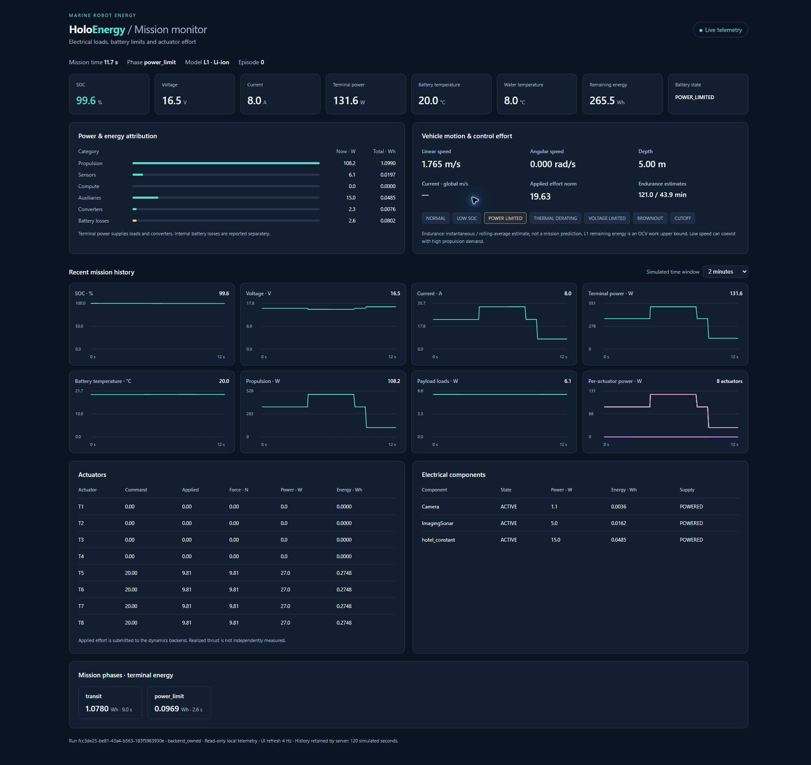

# Real-time HoloEnergy dashboard

La dashboard è una vista opzionale dello stato `Energy`, senza dipendenze
grafiche Python o codice dentro il tick fisico. Server HTTP/UDP locale della
libreria standard, HTML/CSS e Canvas nel browser, package-data nella wheel.

## Scelta e collegamento

Una pagina locale evita un runtime Qt e dipendenze/server applicativi Dash o
Streamlit per otto grafici e tabelle. Non richiede CDN, account o rete esterna.
È portabile dove funzionano Python e un browser moderno; il core importa il
publisher solo quando abilitato. Questa scelta è proporzionata alla telemetria
di un singolo veicolo e non pretende le funzioni di un sistema SCADA.

```bash
holoenergy-dashboard --port 8765 --telemetry-port 8766 --history-seconds 120 --open
```

Configurare il simulatore con:

```yaml
telemetry:
  enabled: true
  port: 8766
  publish_hz: 10
```

Oppure passare `TelemetryPublisher` al wrapper; un publisher condiviso segue il
ciclo di vita del wrapper e viene chiuso con esso. Il comando
`python examples/realtime_energy_demo.py --backend holoocean --steps 600 --hold-seconds 30`
avvia tutto, conserva i risultati in logs/ e mantiene il server 30 s dopo la
missione per leggere il summary. `--backend synthetic` è un test software della
visualizzazione, senza moto fisico. La demo non apre automaticamente una finestra
browser; visitare l'URL stampato.

## Tick, telemetria e refresh

Il publisher usa UDP non bloccante su 127.0.0.1, senza thread nel simulatore.
Il rate è misurato in wall time (default 10 Hz, massimo configurabile 100 Hz),
indipendente dal tempo simulato. JSON include schema_version/event/energy.
Oversized >60,000 byte o socket indisponibile fanno incrementare dropped;
il passo fisico prosegue. Eventi reset/end_mission bypassano il throttle;
l'evento finale comprende esattamente l'ultima riga e il summary completo.

Due thread server ricevono UDP e servono HTTP. La UI legge /api/state a 4 Hz.
History conserva solo campi dei grafici, ultimi 120 s simulati per default,
con massimo 2,400 campioni. I dati completi restano nel log scientifico; un
grafico campionato non sostituisce i dati tick-by-tick.

## Contenuto

| Vista | Valori |
| --- | --- |
| Battery KPIs | SOC %, V, A, terminal W, battery/water °C, remaining Wh, stato |
| Power breakdown | Propulsion, sensors, compute, auxiliary, converters, battery losses: W e Wh |
| Motion | Velocità lineare/angolare, accelerazione, depth, corrente quando disponibile |
| Control effort | Comando originale, sforzo applicato, forza stimata, W e Wh per attuatore |
| Components | Nome, stato, potenza istantanea e Wh |
| Limits | Normal, low SOC, power/thermal/voltage limits, brownout/cutoff |
| Mission | Fase corrente, durata e Wh per fase |
| Endurance | Instantaneous e rolling estimate con base esplicita, non previsione missione |

Otto grafici: SOC, voltage, current, terminal power, battery temperature,
propulsion power, payload power e per-actuator power. SOC ha scala 0–100%;
asse tempo usa secondi simulati non negativi. Payload nel grafico è il rail
elettrico delle categorie componenti; le tabelle distinguono sensors/compute/aux.
Canali opzionali mancanti mostrano un trattino e non valori zero inventati.

## Ciclo di vita e verifiche visive

Stati waiting, live, reset, disconnected dopo 3 s senza campioni, ended.
Un nuovo run/episodio azzera la history; reset non conserva curve appartenenti
all'episodio precedente. Il context manager chiude HTTP/UDP e attende i thread;
un errore di bind rilascia già i socket acquisiti. Fine missione è indipendente
dal successivo hold del server. I test verificano riutilizzo delle porte.

La demo nativa 600 tick / 30 s è stata aperta realmente in Chrome e ispezionata
visivamente. Screenshot full-page:

- [Live: power limit a 11.7 s](screenshots/dashboard_native_live.png).
- [Mission complete a 30.0 s](screenshots/dashboard_native_complete.png).

Verifica DOM: viewport 1920 px, document width 1920 px, nessun overflow
orizzontale o testo che supera le card, otto canvas presenti. Console: nessun
warning/error JS. Controllo visivo di cifre, unità, tabelle, grafici, eventi e
attribution; test funzionali coprono dati assenti e più componenti. Questi
screenshot documentano una verifica desktop reale, non tutti i browser/device.



## Overhead

Benchmark nativo: tre ripetizioni di 300 step per modalità, stesso scenario,
startup escluso, logging disattivato; HTTP polling 4 Hz e publisher 10 Hz.

| Modalità | Media wall time per step |
| --- | ---: |
| HoloOcean | 22.4785 ms |
| HoloOcean + HoloEnergy | 22.4356 ms |
| HoloOcean + HoloEnergy + dashboard service | 22.6778 ms |

Incremento service rispetto a HoloEnergy: **0.2422 ms/step (~1.08%)**.
Differenza energetico–baseline negativa di 0.0429 ms è rumore, non un'accelerazione.
La variabilità per run e il pacing nativo impediscono di isolare un costo core
inferiore a questo rumore. Rendering del browser, eseguito in un altro processo,
non è incluso nel timer step. La dashboard ha un costo misurabile; non modifica
dt, comandi o modelli. Dati in `sources/generic_verification.json`, riproduzione
con `tools/benchmark_energy.py`. Nessuna promessa di overhead zero.
