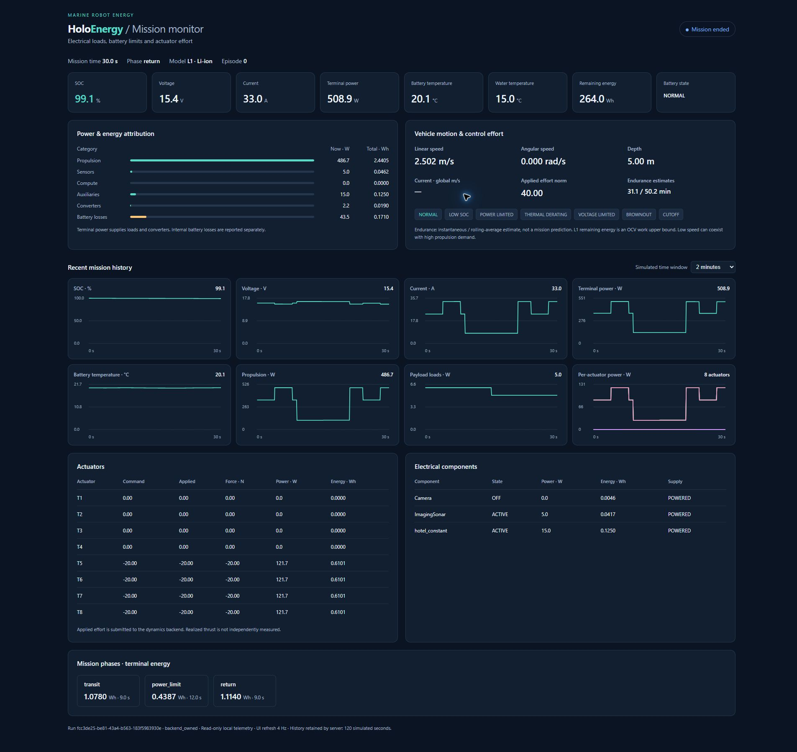

# Report: generic marine energy framework

Data: 6 ottobre 2026. Repository: AndreaBedei1/HoloVirtualBattery.
Evidenze software e configurazioni dimostrative; nessuna calibrazione o
validazione quantitativa dell'hardware reale viene dichiarata.

Aggiornamento successivo: l'[audit del drag nativo](holoocean_drag_units_report.md)
conferma CASE C nel binario Ocean 2.3.0 installato (drag 0.01× SI) e un conflitto
passo fisico/clock a 20 Hz. I risultati correnti di questa fase restano
software coupling; non sono stime fisiche quantitative corrette del veicolo.

## 1. Stato iniziale

Workspace verificato pulito su main. HEAD, origin/main e commit puntato dal tag
v0.1.0 coincidevano con `a7a962b726be3df2856304d2c738a5c1f6e8fc92`.
Analizzati README, documentazione/protocolli/report, modelli, wrapper, profili,
configurazioni, analysis tooling, test, CI e storia recente prima delle modifiche.
Baseline: 106 test passati. Modelli L0/L1, importer T200, bilancio termico,
allocatore e tooling sperimentale conservati, estesi nei punti necessari.

## 2. Branch

`feature/generic-marine-energy-framework`, creato dal main verificato.
Il tag annotato v0.1.0 e il suo commit restano invariati. Nessuna nuova release,
nessun force push, nessuna modifica al motore HoloOcean o ai mondi installati.

## 3. Ricerca scientifica

Ricerca mirata su energia AUV/ROV, hotel load, effort, correnti, thruster,
inflow/transienti, batterie ECM/termiche, Fossen e API HoloOcean 2.3.0.
Fonti primarie prioritarie: publisher IEEE/Elsevier, arXiv degli autori,
documentazione ufficiale del simulatore, Fossen e produttori. Ricontrollate
le fonti elettro-termiche/manufacturer già consolidate. Metadata dei risultati e hash
degli output originali sono
in [sources/generic_research1.json](../sources/generic_research1.json) fino a
generic_research6.json. È una review ingegneristica focalizzata, non una ricerca
sistematica esaustiva. parallel-cli non disponibile: fallback web.run.

## 4. Fonti nuove

S14–S21 in [scientific_sources.md](scientific_sources.md): Fossen Marine Craft
Model; Yang et al. 2022/2018 su controllo energetico AUV; Chang et al. 2022 su
hotel/propulsion/current; Kim/Chung 2006 su inflow; Yoerger et al. 1990 su
dinamica thruster; API agent/currents/Fossen HoloOcean 2.3.
Titoli, autori, anni e DOI verificati su record primari/metadata. Contenuti
full-text e abstract-only sono distinti; nessun coefficiente trasferito tra
veicoli/chimiche. Il checker finale ha risolto nove DOI unici: otto metadata
Crossref e un DOI arXiv DataCite controllato sul repository primario.
[Audit bibliografico](../sources/generic_citation_verification.json).

## 5. Architettura

Nuovi confini: VehicleProfile descrittivo/adapter, ActuatorEnergyModel,
ElectricalComponent/ComponentModel, EnergyRuntime e telemetria opzionale.
Il loader risolve profili package/local, liste/gruppi, alias dal registro dati
e normalizza i nuovi campi sul modello numerico esistente. Nessuna duplicazione
dell'idrodinamica. Il distributore limita sforzi in base a batteria/carichi e
li reinserisce nello step del backend.
[Contratto completo](generic_framework.md), diagramma nel README.

## 6. Assunzioni BlueROV rimosse

Rimossi vincoli core sul nome BlueROV2, otto thruster e scheme 0. Alias T200 nel
registro dei profili; geometria native BlueROV2 solo nell'esempio controller,
non nei modelli. Batterie, sensori e layout non sono default universali.
Il profilo BlueROV2 usa la stessa lista actuators/loader/API dei custom; i
vecchi campi propulsion/sensors e API payload restano compatibili.

## 7. Vehicle API

`VehicleProfile` conserva nome/kind, source/mode dinamico, massa/volume, centri,
dimensioni, drag descrittivo, payload fisico e layout. Unit naming esplicito.
Descriptive segnala `descriptive_only_not_applied`; adapter richiede
configure_vehicle(profile), anche al reset. HoloOcean resta source of truth
della fisica. Proprietà Python native non sono setter C++ affidabili.

## 8. Actuator API

Numero arbitrario, gruppi e modelli eterogenei, ID univoci. Tre ingressi:
profilo misurato, lookup utente command–force–power o force–power, factory
Python registrata. Interfaccia elettrica generale più contratto diretto per
allocator; nessuna legge universale inventata. Forward/reverse e tensioni
distinte, interpolazione nel dominio; force-only non accetta comandi PWM
normalizzati. Nominal pack voltage e domini misti vengono verificati.

## 9. Component API

Nome qualsiasi, stati uppercase configurabili, active_W o states, categoria
sensors/compute/auxiliaries, lookup variabile con input runtime. OFF gating
derivato, startup temporale opzionale, supporto brownout preesistente.
`env.energy.set_component_state` e `set_component_input`; hardware sconosciuto
non richiede codice nel core. Curve/input fuori dominio e stati assenti falliscono.

## 10. Battery API

L0: Wh, tensione, SOC e limite corrente e/o potenza. L1 Rint conserva OCV(SOC,T),
R(SOC,T), capacity(T), current_limit(T), max power, cutoff ed entropy opzionale.
Chemistry è descrittiva, cells series/parallel metadata: non imposta coefficienti
o scala automaticamente profili cella. Pack diretti supportati. Remaining Wh
L1 integra OCV sulla carica accessibile ed è etichettato upper bound.

## 11. Environment API

`env.energy.set_environment` accetta temperatura acqua, densità, vettore corrente
e modalità descriptive/native/adapter. Validazione atomica degli input,
nessun aggiornamento parziale del modello per input invalidi. Densità native
non modificabile tramite API verificata; adapter esplicito richiesto.
Reset ripristina l'ambiente configurato.

## 12. Payload mass/buoyancy

Massa kg, displaced volume m³, position_m e drag opzionale sono separati dal
consumo elettrico. +5 kg non produce automaticamente thrust o potenza.
Non è stato inventato un adapter Unreal: modifiche dinamiche richiedono
asset/backend capace e configure_vehicle verificato. Il confronto replay con
payload neutro/denso dà identica energia a parità di effort perché quel backend
non ha fisica: limite dichiarato, non simulazione di payload dynamics.

## 13. Temperature

Modello one-node consolidato, I²R e reversible heat opzionale, acqua esterna
variabile. Dichiarazioni environment/thermal contrastanti rifiutate. Lo studio
600 tick con mappa R(T) sintetica produce T_bat finale 19.3289 °C con acqua 4 °C,
20.2524 °C con acqua 25 °C; perdite interne 0.0187178 vs 0.0184207 Wh. Stesso
effort e curve power volutamente uguali alle tensioni: terminal Wh resta uguale,
mentre perdite/SOC seguono il modello. Nessuna interpretazione hardware.

## 14. Currents

Metodo pubblico nativo `set_ocean_currents`, agent_name esplicito. Nessun
moltiplicatore energetico. Controller esterno di station keeping con geometria
del solo esempio BlueROV2 e gains dichiarati USER-SUPPLIED.

| Corrente m/s | Velocità media tail m/s | Potenza propulsiva media tail W |
| ---: | ---: | ---: |
| 0.0 | 0.000000 | 0.000000 |
| 0.2 | 0.000003 | 0.219853 |
| 0.5 | 0.000019 | 1.374554 |
| 0.8 | 0.000054 | 3.232518 |

Quattro run nativi 600 tick dimostrano movimento≈0 con potenza>0 per effort
del controller. Sorgente nativo ispezionato: possibile conversione mancante
N→centiN nel drag rispetto a gravity/buoyancy. Conformità sorgente/binario non
dimostrata. Wattaggi piccoli sono proprietà di questa build/configurazione,
non misure reali. Fossen native currents non dichiarate compatibili.

## 15. Dashboard

Dashboard opzionale locale HTML/Canvas con server standard-library HTTP/UDP,
senza Qt/Dash/Streamlit o dipendenze core extra. CLI holoenergy-dashboard.
Trasporto UDP non bloccante con throttle wall-time, drop espliciti; accounting
e log non dipendono dalla ricezione. Demo native avvia robot/energy/server,
applica power limit, cambia acqua/stato camera e chiude tutto.
[Design e istruzioni](dashboard.md).

## 16. Grafici realtime

Otto grafici: SOC, V, I, W terminali, T_bat, propulsione, payload e per-actuator
power. History 120 s / massimo 2,400 campioni, publisher default 10 Hz wall-time,
UI 4 Hz. SOC 0–100%, tempo simulato non negativo, unità esplicite; canali
opzionali mancanti non vengono inventati. Moto e control effort separati.

## 17. Energy attribution

Wh per categoria e dispositivo, realtime, CSV/JSONL e summary JSON/CSV.
Terminal = propulsion+sensors+compute+auxiliaries+converters; OCV work aggiunge
battery losses. Percentuali rispetto a OCV work. Demo nativa: 2.630748 Wh
terminali, 0.171011 Wh perdite interne, 2.801759 Wh OCV work. Bilanci verificati;
telemetria finale conserva esattamente l'ultimo tick.

## 18. Mission phases ed endurance

`mark_phase` marca i tick successivi, accumula durata/terminal Wh/loss Wh.
Demo: transit 9 s/1.077976 Wh; power_limit 12 s/0.438736 Wh; return 9 s/1.114036 Wh.
Reset conserva summary precedente. Endurance istantanea e rolling weighted mean
con finestra configurabile fino a 60 s: sono stime osservate e ottimistiche L1,
non completamento certo della missione. Un futuro planner può usare replay e
completion_observer, già separato dalla sequenza comandi eseguita.

## 19. Custom vehicle acceptance

[my_vehicle_energy_demo.py](../examples/my_vehicle_energy_demo.py) e
[custom_rov.yaml](../configs/custom_rov.yaml): pack 24 V/30 Ah, sei curve custom,
sonar/camera/DVL/compute, acqua 8 °C. Esecuzione senza built-in hardware o core
edits; test completo YAML. Runtime compute lookup dimostrato dalla variante
Python. Nessun parametro è attribuito a un costruttore.

## 20. Generic ROV

[generic_lightweight_rov.yaml](../holoenergy/profiles/vehicles/generic_lightweight_rov.yaml):
quattro attuatori, L0 12 V/120 Wh, massa descrittiva 6 kg, camera/compute.
Demonstration configuration con metadata e placeholder espliciti.
Demo 20 tick: 0.022222 Wh; non simula fisica nativa del nuovo asset ROV.

## 21. Generic AUV

[generic_auv.yaml](../holoenergy/profiles/vehicles/generic_auv.yaml): un propulsore
force-only, L1 24 V/30 Ah, massa descrittiva 32 kg, survey sensor/compute/modem.
Demonstration configuration; differente suite/tensione/capacità/propulsione.
Demo 20 tick: 0.019306 Wh. Non è presentata come REMUS o altro hardware misurato.

## 22. BlueROV regression

I 106 test originari restano passanti (nessuno rimosso per mascherare una failure).
Importer riproduce il JSON T200 originale byte-for-byte rispetto a Git.
L0/L1, R(SOC,T), payload, logging, sensitivity, validation e provenance
mantengono la regressione. Lo scenario nativo precedente è conservato; la demo
realtime aggiunge uno scenario leggero con DynamicsSensor.

## 23. Tests e acceptance comparisons

Python 3.13.12: **144 passed**. Ambiente HoloOcean Python 3.10.20: **143 passed,
1 skipped**, perché i test unitari non lanciano un simulatore installato.
Lint/format passati. Fixture custom per 1/4/6/8 attuatori, mixed, zero/sensor-heavy
loads, chemistry labels, lookup/startup, fasi/reset/summary, temperature/current
adapter, fail-fast dati invalidi, pack/domains e shutdown anche con errore export.
Dashboard: startup/live/reset/end/disconnection, optional/multiple loads,
high-frequency throttle, oversized/malformed packets, riuso porte/clean shutdown.

[generic_scenarios.py](../examples/generic_scenarios.py) verifica sette missioni
di 600 tick con lo stesso effort: acqua 4/25 °C, pack 15/30 Ah, payload fisico
neutro/denso, payload elettrico +18 W. Il pack 15 Ah perde circa il doppio SOC;
+18 W aggiunge esattamente 0.15 Wh in 30 s; payload descrittivi non falsificano
la fisica. Correnti confrontate separatamente nelle quattro missioni native.

## 24. CI e packaging

Matrice Linux/Windows × Python 3.10/3.11/3.12/3.13, locked install, pytest,
ruff, importer, wheel/sdist. Aggiunto smoke test della wheel in ambiente
isolato con Python -I: nessun import sorgente, registro profili/HTML presenti,
tre veicoli utilizzabili e server avviabile/chiudibile. Wheel locale verificata.
La [CI remota sul commit 84c02a4](https://github.com/AndreaBedei1/HoloVirtualBattery/actions/runs/37479055641)
ha completato tutti gli otto job con successo; la verifica finale del nuovo HEAD
documentale viene riportata nel messaggio di consegna.
Unreal/GPU rimangono test manuali, non falsi job CI headless.

## 25. HoloOcean native checks

Versione 2.3.0, mondo Ocean/SimpleUnderwater, Python 3.10.20, dt 0.05 s.
Regressione 60 tick con limite simulato 8 A: displacement surge **2.473942 m**
con derating contro **4.674221 m** accounting-only. Sforzi inviati verificati,
native clock coerente, reset e engine_process_closed true.
Demo realtime 600 tick/30 s: minimum factor **0.395797**, azioni ridotte al backend,
342 pacchetti inviati/0 dropped. Lo scenario cambia acqua e spegne camera.
Nessun processo simulator/server di questi esempi rimasto attivo al controllo.

*Nota successiva (7–8 ottobre 2026):* questi controlli usavano dt 0.05 s (20 Hz),
dove UE 5.3 integra solo 1/30 s per tick, e il binario 2.3.0 ufficiale, che applica
il drag a 1/100 della propria equazione. Gli esempi nativi usano ora 100 Hz e
rifiutano dt > 1/30 s; il derating è stato riverificato sul backend corretto
(build patchata, 100 Hz: fattore minimo 0.4906, surge 1.050 m contro 1.553 m).
I numeri sopra restano validi come prova di accoppiamento software, non come
dinamica quantitativa: vedi [verified_backend_report.md](verified_backend_report.md)
e [holoocean_compatibility.md](holoocean_compatibility.md).

## 26. Screenshots e visual verification

Chrome reale, full-page live a 11.7 s e ended a 30.0 s. Verificati leggibilità,
unità, break-down, grafici, fasi e power limit; otto canvas, zero card clipped,
zero overflow orizzontale, console senza warning/error. Viewport/document 1920 px.
Non è una promessa di QA su ogni browser/device.
[Live](screenshots/dashboard_native_live.png),
[complete](screenshots/dashboard_native_complete.png).

## 27. Performance

Tre trial nativi × 300 step per modalità, startup escluso e logging disattivato.
Baseline **22.4785 ms/step**, HoloEnergy **22.4356 ms/step**, con dashboard
service **22.6778 ms/step**. Incremento dashboard **0.2422 ms (~1.08%)** rispetto
all'energia. Differenza negativa del core è rumore/pacing, non speedup.
Rendering browser non incluso nel timer simulator-step. Risultati dipendenti
da macchina/carico e variabilità riportata nei record; nessuna promessa zero cost.
Comando riproducibile tools/benchmark_energy.py.

## 28. Placeholder rimasti

BlueROV: OCV, R effettiva pack, mappe in temperatura, C_th/k, hotel, efficienze
payload/hotel e soglie termiche dimostrative. Camera/Ping360 usano massimi,
non consumi medi validati. Profili compact/AUV e curve custom completamente
sintetici/USER-SUPPLIED; masse/volumi descrittivi. Gains controller e limite 8 A
sono interventi del test, non rating o calibrazioni del veicolo.

## 29. Limiti scientifici

Un agente, un pack, scarica only, modelli thruster quasi-statici/bollard,
batteria Rint media e thermal one-node. Nessuna cell-by-cell, aging/BMS/CFD,
inflow dinamico, idrodinamica duplicata o planner completo. Added mass e payload
dynamics spettano al backend. Native source/current unit issue e source/binary
conformance non risolti da moltiplicatori arbitrari. Applied effort è sforzo
sottoposto al backend, non thrust effettivo misurato. Multi-battery studiato
come futuro manager/bus routing, non dichiarato implementato.

## 30. Esperimenti fisici necessari

Pack OCV/R(SOC,T), capacità/current-limit(T), cutoff e thermal identification;
consumi/duty-cycle reali sensori/compute, efficienza rail; thrust installato con
inflow e transitori; proprietà dinamiche base/payload; validazione indipendente
V/I/P/SOC/T/Wh/durata ed eventuali cutoff. Separare calibrazione e validation
dataset, errori/strumenti/incertezze tramite tooling già mantenuto.
Il BlueROV2 è il primo validation case, usando sempre la API generica.

## 31. Commits

| Commit | Contenuto |
| --- | --- |
| `22aa995` | refactor: generalize configurable marine energy models and accounting |
| `0b993b0` | feat: add optional realtime dashboard and reproducible native experiments |
| `2b86c3d` | fix: preserve missing telemetry values in dashboard displays |
| `aafd890` | docs: document generic contracts and scientific verification |
| `bfc9e31` | docs: retain research metadata and source links |
| `84c02a4` | fix: use generic vehicle wording in control and study messages |
| `docs: complete legacy custom profile provenance and final audit` | Completa metadata del template payload originale e registra l'audit finale; identificabile nella storia del branch |

I log native mantengono il commit/dirty flag effettivi di sviluppo, hash sorgente,
profili/scenario/input. Non vengono retroattivamente marcati come clean-final.
[Archivio compatto con hash raw](../sources/generic_verification.json),
[ispezione sorgente native](../sources/generic_native_source_inspection.json).

## 32. Push status e audit finale

Push non forzato del branch autorizzato. Tag v0.1.0 preservato; nessuna release
creata. Verifica finale remote HEAD e CI riportata nel messaggio di consegna.
Branch: [feature/generic-marine-energy-framework](https://github.com/AndreaBedei1/HoloVirtualBattery/tree/feature/generic-marine-energy-framework).

Audit finale in tre prospettive: un utente con ROV diverso può configurare il
file completo ed eseguire una demo senza hardware built-in; un reviewer trova
equazioni/provenienza e limiti distinti da validation; un ricercatore trova
comandi, scenario, gains, raw-log hashes e screenshot per riprodurre le prove.
Il confine che resta operativo è configurare/calibrare la dinamica fisica del
proprio backend e raccogliere dati reali: il layer energetico non la sostituisce.
