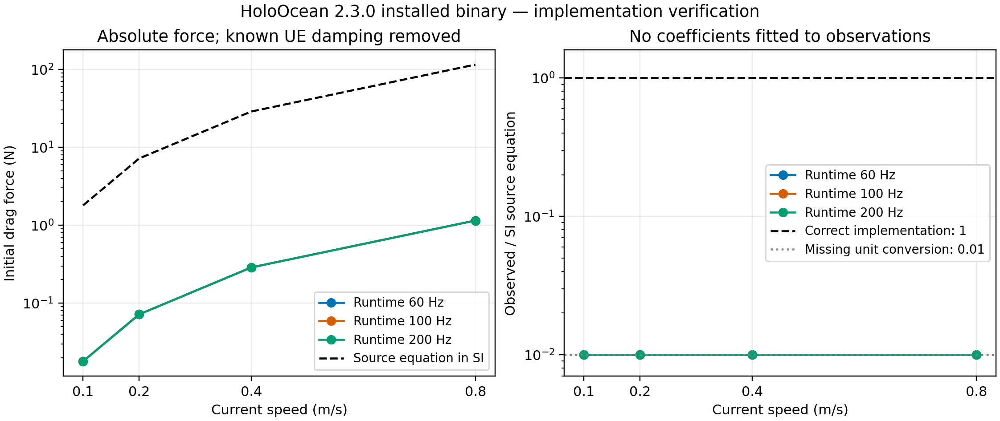

# Verifica delle unità del drag nativo HoloOcean 2.3.0

Audit del 6 ottobre 2026. **CASE C: il binario Ocean installato applica un
drag circa 100 volte più piccolo dell'equazione SI dichiarata.** La dipendenza
quadratica, il segno e gli assi della corrente sono coerenti. Gravity, buoyancy
e thruster seguono invece la conversione N → kg·cm/s². Nessun modello numerico
HoloEnergy è stato modificato.

Questa è *physics implementation verification*. Non è validazione fisica del
BlueROV2 reale. La patch è preparata e reversibile, ma non compilata né provata
su una build UE corretta. L'installazione originale rimane invariata.

## 1. Versione realmente utilizzata

Client Python `holoocean==2.3.0`, Python 3.10.20 nell'ambiente
`C:/Users/Andrea/miniconda3/envs/holoocean_joystick`. Package Ocean 2.3.0,
world `SimpleUnderwater`, agente `BlueROV2`, control scheme 0. Il binario è:

```text
C:/Users/Andrea/AppData/Local/holoocean/2.3.0/worlds/Ocean/Windows/Holodeck/Binaries/Win64/Holodeck.exe
SHA256 8c206c9cc05c640fb2efea6bd43bda33c585536ab16a931c55780855e7602253
Size   255731200 bytes
```

Percorsi client, install origin, piattaforma, package config e hash sono nel
[report runtime](../sources/holoocean_drag_audit/verified/report.json).
`direct_url.json` registra un'installazione dalla directory Downloads del
client 2.3.0, oggi non presente. Gli
[hash dei container Ocean](../sources/holoocean_drag_audit/ocean_asset_hashes.json)
identificano anche gli asset effettivamente installati.

## 2. Sorgente analizzato e upstream

Archivio locale, senza `.git`:
`C:/Users/Andrea/Desktop/Holoocean2-3/HoloOcean-2.3.0/HoloOcean-2.3.0`.
`Holodeck.uproject` indica UE 5.3. Il tag ufficiale
[`v2.3.0`](https://github.com/byu-holoocean/HoloOcean/tree/v2.3.0) punta a
`49e70552dfd97273b7dfbe755fbe65d7738b24b7`, merge del 5 febbraio 2026.
Nove file C++ critici e `environments.py` locali sono identici byte per byte al
tag. Anche i cinque moduli client installati confrontati coincidono col tag.
Vedi [hash e confronti](../sources/holoocean_drag_audit/source_upstream.json).

La ricerca upstream ha incluso tag, 100 commit develop, issue/PR recenti,
query GitHub dedicate, documentazione e
[changelog 2.3.0](https://byu-holoocean.github.io/holoocean-docs/v2.3.0/changelog/changelog.html).
I metadati sono conservati in
[upstream_records.json](../sources/holoocean_drag_audit/upstream_records.json)
e [upstream_search.json](../sources/holoocean_drag_audit/upstream_search.json).
Non si dichiara esaustività su tutti i branch storici.

| Record | Data pertinente | Evidenza |
| --- | --- | --- |
| [PR 287](https://github.com/byu-holoocean/HoloOcean/pull/287) | merge 2025-11-12 | Commit `d997151c7d1c773789d6409b579426fe39ccc68f`; il percorso drag senza conversione è già presente. |
| [PR 308](https://github.com/byu-holoocean/HoloOcean/pull/308) | merge 2026-01-14 | Commit `b15b730a3be6797211337736aec7706786509dd3`, aggiorna i test correnti. |
| [PR 327](https://github.com/byu-holoocean/HoloOcean/pull/327) | merge 2026-02-05 | Release 2.3.0, commit del tag sopra. |
| [Issue 368](https://github.com/byu-holoocean/HoloOcean/issues/368) | aperta 2026-08-04; aggiornata 2026-08-05 | Segnala deriva molto piccola sotto corrente. Il [maintainer](https://github.com/byu-holoocean/HoloOcean/issues/368#issuecomment-5196831202) conferma l'intento m/s e riconosce un possibile bug. Nessuna patch merged è dimostrata dal commento. |
| [PR 351](https://github.com/byu-holoocean/HoloOcean/pull/351) | aperta 2026-06-04; aggiornata 2026-07-13 | Discussione waves/buoyancy 2.4.0, chiusa; API `merged_at=null`, quindi non presentata come PR merged. |
| [Develop ispezionato](https://github.com/byu-holoocean/HoloOcean/tree/4c7637ab81f1d3bed2fd94b35f2832bf034c3a4e) | HEAD 2026-09-28 | Nei tre percorsi relative-flow drag esaminati (`ApplySurfaceBuoyancy`, `ApplyUnderwaterBuoyancy`, `ApplyWavelessForces`) non è presente la conversione di grandezza. Non è una prova runtime della versione 2.4. |

Il test upstream `client/tests/scenarios/test_currents.py` contiene una
accelerazione attesa hardcoded per HoveringAUV, non un oracolo dimensionale
indipendente. Un test che riproduce uno snapshot numerico non dimostra la
correttezza delle unità assolute.

## 3. Corrispondenza sorgente/binario

**Identità esatta della build non stabilita.** Versione package, uguaglianza
dei sorgenti locali col tag e accordo del comportamento non provano il commit
con cui è stato compilato l'eseguibile. FileVersion/ProductVersion non
forniscono un'identità utile. Il manifest NonUFS registra il file eseguibile
con timestamp 2026-01-29T00:12:35.265Z, precedente al tag del 5 febbraio.
Non è disponibile un commit di build incorporato verificato.

Separazione mantenuta: il source review dimostra la conversione mancante
nel tag; l'esperimento sul binario identificato dal suo hash dimostra la scala
0.01. Questi due risultati concordano sul percorso esaminato senza dimostrare
che ogni altro file della build sia quello del tag.

## 4. Unità Unreal verificate

La documentazione ufficiale di
[`AddForceAtLocation`](https://dev.epicgames.com/documentation/en-us/unreal-engine/API/Runtime/Engine/UPrimitiveComponent/AddForceAtLocation)
specifica forza e posizione in world space;
[`AddForce`](https://dev.epicgames.com/documentation/en-us/unreal-engine/API/Runtime/Engine/UPrimitiveComponent/AddForce)
distingue `bAccelChange`, che ignora la massa. Le pagine disponibili sono la
documentazione corrente, non una prova della specifica build 5.3.
La [tabella generale delle unità](https://dev.epicgames.com/documentation/unreal-engine/units-of-measurement-in-unreal-engine?lang=en-US)
elenca anche unità di visualizzazione SI. Non dimostra una conversione
automatica del vettore numerico nell'API raw della fisica.

È stato letto anche il sorgente ufficiale Epic ref `5.3`: wrapper
PrimitiveComponent → BodyInstance, integrazione Chaos Euler e ether damping,
default gravity e physics settings. Le chiamate wrapper seguono la forza raw,
senza moltiplicazione implicita per 100 nei passaggi esaminati.
Con lunghezze raw in cm, massa kg e tempo s, la forza coerente è kg·cm/s²:
**1 N = 100 unità raw, cioè 100 cN**. La catena assoluta è confermata dalle
prove indipendenti di thruster e gravity.
URL, ref, blob e SHA256 SDK sono in
[unreal_sdk_metadata.json](../sources/holoocean_drag_audit/unreal_sdk_metadata.json).
Il codice Epic è rimasto fuori dagli artefatti pubblicati. Non si dichiara
che sia stato compilato localmente o che sia il sorgente esatto del binario.

## 5. Legge di drag implementata

```text
v_rel = v_vehicle - v_water
F_drag,SI = -0.5 rho Cd A |v_rel| v_rel × submerged_ratio
```

Con rho in kg/m³, area in m² e velocità in m/s, il risultato è kg·m/s² = N.
Il segno oppone il moto relativo. Per veicolo fermo la forza segue la corrente.
La base fisica della velocità relativa è coerente con
[Fossen, marine craft model](https://fossen.biz/html/marineCraftModel.html);
la relazione quadratica e il significato dell'area di riferimento sono
descritti nella [drag equation NASA](https://www1.grc.nasa.gov/beginners-guide-to-aeronautics/drag-equation/).
Non sono stati trasferiti coefficienti aerodinamici al BlueROV.
Il source usa una singola area e Cd isotropi: non calcola un'area proiettata
diversa per orientamento. La verifica delle unità non valida questa scelta
rispetto alla geometria reale, Reynolds, added mass o coefficienti misurati.

## 6. Tabella delle quantità

| Quantità | SI / valore BlueROV2 | Rappresentazione e conversione | API / destinazione |
| --- | --- | --- | --- |
| Position, COM, COB | m | Raw UE cm; conversione posizione /100 e riflessione Y verso client | Phys body, location, sensori |
| Vehicle velocity | m/s | `GetUnrealWorldVelocity()/100`, assi UE world | RelativeVel |
| Current | m/s | Input client NWU world; storage invariato; getter `[x,-y,z]` | RelativeVel |
| Relative velocity | m/s | Differenza in assi UE world | Equazione drag |
| Density | 997 kg/m³ | Literal `WaterDensity`, nessuna conversione | Equazioni SI |
| Cd | 0.8, adimensionale | Literal BlueROV2 | Equazione drag |
| Area | 0.45 m² | Literal BlueROV2, costante isotropa | Equazione drag |
| Mass | 11.5 kg | `SetMassOverrideInKg` | UE rigid body |
| Volume | m³ | Constructor 0.03554577; con `Perfect=true` viene sostituito da m/rho = 0.01153460381 m³ | Buoyancy |
| Gravity acceleration | 9.8 m/s² | World gravity raw −980 cm/s² diviso −100 | Forza mg |
| Gravity force | N | `ConvertLinearVector(ClientToUE)` ×100 | `AddForceAtLocation`, COM |
| Buoyancy force | N | rho g V ratio, stessa conversione ×100 | `AddForceAtLocation`, COB |
| Thruster command | N | Signed, clamp per thruster ±28.75 N; conversione ×100 e Y, poi rotazione body → world | `AddForceAtLocation`, thruster |
| Drag force | N | **N numerici passati direttamente; conversione ×100 assente** | `AddForceAtLocation`, COM |
| Raw UE force | kg·cm/s², cN | 100 unità raw per N | Physics solver |
| Angular velocity / attitude | rad/s / gradi | Sensore Dynamics restituisce velocità angolare rad/s e RPY gradi | Controlli sperimentali |
| Acceleration / time | m/s² / s | Differenza velocità / DeltaTime native; clock Python incrementa 1/tps | Sensore e FD indipendente |

`UEUnitsPerMeter=100`; la conversione di torque usa una scala quadratica
separata. Né massa né densità vengono convertite tramite l'helper dei vettori
lineari. Lo stato del pack HoloEnergy non modifica queste proprietà native.

## 7. Percorso della corrente

`set_ocean_currents(agent_name, [x,y,z])` pubblico → `OceanCurrentsCommand` →
float C++ invariati → getter riflette Y → corrente UE world in m/s → differenza
con velocità world/100. Il test yaw 90° mantiene la deriva sull'asse world X:
non è una corrente body-frame. Le prove ±X, ±Y, ±Z verificano il segno.
La documentazione ufficiale è
[ocean currents 2.3](https://byu-holoocean.github.io/holoocean-docs/v2.3.0/agents/docs/currents.html).

## 8. Percorso del drag

`HolodeckBuoyantAgent.cpp` righe 87–96: calcola `RelativeVel`, poi forza SI
alle righe 91–92; alle righe 93–95 la passa senza scala all'API raw.
Il fattore di immersione è 1 nelle prove. Il vettore è già UE world:
convertirne nuovamente gli assi sarebbe un errore. Altri agenti nativi
HoveringAUV/Torpedo/Cougar/Surface usano la base buoyant; i loro parametri
differiscono. Non sono stati eseguiti audit runtime di ciascun altro agente.
La scala riguarda anche l'autodrag quando il veicolo si muove con corrente zero.

## 9. Percorso gravity

`GetGravityZ()/-100` → g SI → `[0,0,-m g]` N → ×100 → COM.
Il valore del world testato è 9.8, coerente col default Epic −980; lo scarto
da 9.81 è circa 0.1% e non spiega il fattore 100 del drag.

## 10. Percorso buoyancy

rho g V ratio → `[0,0,B]` N → ×100 → COB. `Perfect=true` impone V=m/rho.
COM al piano dei thruster orizzontali, COB 5 cm sopra: assetto iniziale nullo
e fully submerged riducono le ambiguità. La quiete neutra verifica il
bilanciamento risultante; non è una misura separata della forza B con un
sensore di carico. Con gravity verificata e neutralità si vincola la buoyancy
netta nella configurazione testata.

## 11. Percorso thruster

Mode 0: nessun PID, comando otto forze N → geometria e clamp C++ → helper
lineare ×100/riflessione Y → rotazione → applicazione alle posizioni thruster.
Quattro thruster inclinati producono complessivamente 10 N su X o Y senza
torque risultante; quattro verticali da 2.5 N producono 10 N su Z.
La forza di riferimento è netta, non 10 N assegnati a ogni thruster.
Il controllo abilita linear damping 1/s e angular damping 0.75/s.

Fossen è un contratto distinto: modello Python in SI/NED, conversione verso
accelerazioni custom NWU, percorso `bAccelChange` mass-independent. Il comando
native current non aggiorna automaticamente il `V_current` Fossen. Nessuna
conclusione di questo audit native è trasferita a Fossen; vedi
[Fossen dynamics 2.3](https://byu-holoocean.github.io/holoocean-docs/v2.3.0/agents/docs/fossen-based-dynamics.html).

## 12. Inconsistenza e controllo del passo

Gravity/buoyancy/thruster convertono N → cN, drag no. L'integrazione UE aggiunge
anche damping, quindi `m a` osservato sul primo tick non coincide esattamente
con la forza applicata. Dal solver Epic esaminato, senza clamp/substeps:

```text
G = 1 - linear_damping × dt
v_next = G × (v_before + F_applied dt / mass)
F_reconstructed = mass × (v_next/G - v_before) / dt
```

G è derivato dal source, non adattato ai risultati. Le prove 10 N e gravity
verificano questa ricostruzione a 60, 100, 200 Hz. Anche il rapporto indipendente
`(m a_drag/F_expected)/(m a_thruster/10 N)` rimuove l'attenuazione comune al
primo impulso da fermo e dà circa 0.01.

La prima campagna a 20/100/200 Hz è conservata con esito **INCONCLUSIVE**, non
riscritta come successo: a 20 Hz l'ipotesi dt_physics=dt_clock non passa i
riferimenti assoluti. Il default UE 5.3 `MaxPhysicsDeltaTime=1/30 s`,
`bSubstepping=false`, è coerente con i dati: clock 0.05 s, primo `m a_thruster`
6.4444445 N e `a_gravity` −6.315556 m/s². L'incremento posizione del primo
impulso X è coerente con 1/30 s. Non è stato misurato direttamente il clock
interno del solver né dimostrata l'identità della sua configurazione compilata.
Questo è un effetto distinto, non una correzione fittata del Cd.
Il rapporto normalizzato drag/thruster a 20 Hz resta circa 0.01.
L'audit rifiuta comunque la classificazione globale quando i riferimenti falliscono.

## 13. Esperimenti e controlli

Campagna decisiva: **17 casi × 3 frequenze × 3 ripetizioni = 153 casi**, 8
impulsi per caso, 1224 osservazioni conservate. Native-only: nessun import
HoloEnergy, PID o controller. Preparazione con API pubblica, prime del sensore
dopo teleport, copie dello stato per evitare buffer mutabili. Pose iniziale
nota a profondità 5 m, velocità nulla, neutralità, thruster zero nei casi drag.

Casi: quiete neutra; X 0.1/0.2/0.4/0.8; X negativo; ±Y/±Z; yaw 90° con
corrente world X; thruster 10 N X/Y/Z; gravity in aria a z=20 m; moto 0.4 m/s
in acqua ferma; corrente uguale alla velocità iniziale effettiva.
Il damping agisce anche quando il drag relativo iniziale è zero.

Controlli indipendenti, con dati in
[independent_checks.json](../sources/holoocean_drag_audit/independent_checks.json):

| Controllo | Risultato |
| --- | --- |
| Forza netta thruster 10 N, ricostruita | errore massimo 6.19e−7 N |
| Gravity 9.8 m/s², damping rimosso | errore massimo 7.17e−7 m/s² |
| Massa inferita da 10 N e accelerazione | 11.49999984–11.50000072 kg |
| Velocità quiete neutra | zero nelle osservazioni |
| Collisioni | nessuna segnalata |
| Velocità angolare | massimo 5.60e−17 rad/s |
| FD velocità/timestamp contro native acceleration | massimo 5.73e−6 m/s² |
| FD posizione contro velocità, impulsi thruster | massimo 5.66e−5 m/s; include quantizzazione float verticale |
| Predizione source non corretto vs runtime, tutte le osservazioni | errore massimo 9.16e−8 m/s |

Il timestamp Python da solo non verifica il passo fisico: sono proprio i
riferimenti assoluti e la posizione a distinguere il caso 20 Hz.

## 14. Expected vs observed force

Prima accelerazione a 100 Hz, trial 0; forza inferita con G=0.99. Coefficienti
recuperati dal source: K=rho Cd A/2 = 179.46 N/(m/s)².

| Current m/s | Equazione SI N | `m a` osservato N | Forza ricostruita N | Errore rispetto SI |
| ---: | ---: | ---: | ---: | ---: |
| 0.1 | 1.794600 | 0.017766539 | 0.017945999 | −99.000000% |
| 0.2 | 7.178400 | 0.071066157 | 0.071783997 | −99.000000% |
| 0.4 | 28.713600 | 0.284264627 | 0.287135987 | −99.000000% |
| 0.8 | 114.854400 | 1.137058507 | 1.148543946 | −99.000000% |

La forza netta raw `m a` comprende il damping del tick. La forza ricostruita
isola la scala del termine sorgente. Non si presentano i due numeri come
misure identiche. [CSV](../sources/holoocean_drag_audit/verified/first_pulse.csv)
e [JSON](../sources/holoocean_drag_audit/verified/report.json) mantengono la
precisione originale per tutte le frequenze/ripetizioni/assi.

## 15. Rapporto observed/expected

Media primi impulsi X: **0.009999999703068724**.
Intervallo: **0.009999999188257584–0.010000000389527840**.
Stesso intervallo nei casi di corrente con segno e yaw verificati. La scala
0.01 è la conseguenza dimensionale della conversione mancante, non un parametro
inserito nel layer energetico per far tornare i dati.



## 16. Scaling quadratico

F(0.2)/F(0.1), F(0.4)/F(0.2), F(0.8)/F(0.4) sono tutti circa **4**,
con scarti dell'ordine di 1e−13 nei primi impulsi di questa campagna. La legge
relativa è corretta; questo risultato da solo non certifica la scala assoluta.

## 17. Risultato finale A/B/C

**CASE C — real runtime bug** sul binario Ocean identificato. Source review,
analisi dimensionale, SDK/documentazione ufficiali e runtime controllato
concordano sulla scala errata. CASE B escluso dal comportamento osservato;
CASE A non compatibile con il confronto assoluto. La campagna diagnostica
20 Hz conserva il proprio conflitto sulle ipotesi di integrazione.

## 18. Patch isolata

[`patches/holoocean-2.3-drag-units.patch`](../patches/holoocean-2.3-drag-units.patch)
aggiunge una sola conversione `DragForce *= UEUnitsPerMeter;` dopo l'equazione
SI. Non riflette gli assi. Coefficienti, gravity, buoyancy e thruster invariati.
La [procedura](../patches/README.md) indica applicazione/reversione in una copia
separata. [Check registrato](../sources/holoocean_drag_audit/patch_verification.json):
apply/check/reverse/check passati e bytes/hash originali ripristinati.
Il source locale stabile e l'eseguibile originale non sono stati modificati.

## 19. Before/after e limite della verifica della patch

| Current m/s | Expected N | Before ricostruito N | Before errore | After runtime N | After errore |
| ---: | ---: | ---: | ---: | --- | --- |
| 0.1 | 1.7946 | 0.017946 | −99% | non eseguito | non disponibile |
| 0.2 | 7.1784 | 0.071784 | −99% | non eseguito | non disponibile |
| 0.4 | 28.7136 | 0.287136 | −99% | non eseguito | non disponibile |
| 0.8 | 114.8544 | 1.148544 | −99% | non eseguito | non disponibile |

Non è stata trovata un'installazione di sviluppo UE 5.3 utilizzabile né cooker
registrato; MSVC/Visual Studio sono presenti. La distribuzione Ocean è una
build cooked, non sostituisce l'engine di sviluppo. Nessun numero analitico
è etichettato come misura after. Prima di adottare la patch occorre compilare
un world separato e rieseguire la campagna con `--binary` puntato a esso.

## 20. Regressioni delle altre forze

Sul binario **before**: passano gravity, neutralità/buoyancy netta, thruster
X/Y/Z, corrente zero e corrente costante alle tre frequenze valide. La patch
ha un diff limitato al drag e la reversibilità è verificata. Le regressioni
fisiche **after non sono eseguite**; non si dichiara la build patchata sicura
o numericamente verificata sulla sola base di un diff.

## 21. Station keeping dopo l'audit

Ripetute le quattro condizioni originali, 600 tick a 20 Hz, 30 s sul clock
client/energy, binario before. Media sulle ultime 100 osservazioni;
effort è la norma L2 del vettore delle otto forze comandate, non la forza netta.

| Current m/s | Mean speed m/s | Mean effort norm N | Mean propulsion W | Terminal total Wh | Propulsion Wh |
| ---: | ---: | ---: | ---: | ---: | ---: |
| 0 | 0 | 0 | 0 | 0.195370370 | 0 |
| 0.2 | 0.000002598 | 0.050776151 | 0.219853405 | 0.197201743 | 0.001831373 |
| 0.5 | 0.000018560 | 0.317410903 | 1.374553585 | 0.206818498 | 0.011448128 |
| 0.8 | 0.000054366 | 0.812745200 | 3.232518299 | 0.221794208 | 0.026423838 |

I dati riproducono le misure precedenti, ma il drag è ora confermato errato.
Inoltre il caso 20 Hz ha un conflitto passo fisico/clock: 30 s energy non sono
certificati come 30 s di integrazione fisica. Sono **software coupling tests**,
non nuove stime quantitative di station keeping corretto.
JSON, scenario e log compressi con hash sono in
[station_keeping/report.json](../sources/holoocean_drag_audit/station_keeping/report.json).
Non è stato applicato alcun fitting o moltiplicatore di consumo.

## 22. Conseguenze sui risultati HoloEnergy precedenti

Le mappe T200, accounting Wh, battery/Rint e thermal non sono stati cambiati.
Restano verificabili come implementazioni software con i propri domini e dati.
Le prestazioni energetiche guidate dalla dinamica native di questo binario,
con correnti o autodrag, non certificano le equazioni SI di resistenza del
veicolo. Non si possono correggere Wh e power moltiplicandoli per 100:
controller, lookup, saturazioni e transitori rendono il problema non lineare.
Occorre rieseguire su un backend corretto e con passo fisico verificato.

## 23. Claim scientifici supportati

Il source tag 2.3.0 omette la conversione di grandezza del drag; il binario
installato produce un drag 0.01× l'equazione SI nel test native BlueROV2;
dipendenza quadratica/assi/segno sono verificati nelle condizioni descritte.
Thruster, gravity e neutralità passano riferimenti assoluti a 60/100/200 Hz.
Il coupling controller → effort → accounting elettrico è riproducibile.

## 24. Claim ancora non supportati

Nessuna physical validation del BlueROV2 reale, nessuna identificazione di
Cd/area/added mass, nessuna verifica native trasferita a Fossen, nessuna prova
runtime della release 2.4 o di tutti gli altri agenti, nessuna identità esatta
source/build del binario, nessuna verifica dopo ricompilazione della patch.
Il backend originale non implementa correttamente la scala assoluta del drag.

## 25. Draft upstream

Preparato [holoocean_drag_issue_draft.md](holoocean_drag_issue_draft.md), con
riproduzione, riferimenti assoluti e proposta minima. Può integrare la issue
368 già esistente. **Nessuna issue o commento è stato pubblicato.**

## 26. Tooling, provenance e test

Tool source/provenance e oracolo SI:
[`tools/audit_holoocean_drag.py`](../tools/audit_holoocean_drag.py).
Driver native: [`examples/verify_holoocean_drag_units.py`](../examples/verify_holoocean_drag_units.py).
Python/HoloOcean originali richiesti solo per il runtime. Nessuna dipendenza
core aggiunta. Matplotlib è opzionale per la figura.

```powershell
$nativePython = 'C:/Users/Andrea/miniconda3/envs/holoocean_joystick/python.exe'
$auditSource = 'C:/Users/Andrea/Desktop/Holoocean2-3/HoloOcean-2.3.0/HoloOcean-2.3.0'
& $nativePython tools/audit_holoocean_drag.py --source-dir $auditSource
& $nativePython examples/verify_holoocean_drag_units.py --source-dir $auditSource --ticks-per-sec 60 100 200 --repeats 3 --steps-per-case 8 --output-dir logs/drag_audit_new
# Diagnostic explicitly retains INCONCLUSIVE if absolute references fail:
& $nativePython examples/verify_holoocean_drag_units.py --source-dir $auditSource --ticks-per-sec 20 --output-dir logs/drag_diagnostic_new
# A separately rebuilt world can be passed via --binary C:/separate/.../Holodeck.exe.
& $nativePython tools/plot_holoocean_drag_audit.py --report sources/holoocean_drag_audit/verified/report.json
```

Su nuove versioni/layout source, verificare prima i parametri e i percorsi:
il parser fallisce quando non riconosce i literal/pattern supportati. Questo
oracolo non certifica automaticamente un modello modificato senza source review.

L'archivio [sources/holoocean_drag_audit](../sources/holoocean_drag_audit)
conserva JSON/CSV, scenari, osservazioni JSONL gzip deterministiche, hash raw e
gzip, sorgenti tooling della campagna e fonti metadata. Il report registra
commit base `62c18cfcc6197684be246d08388cf4f11f9b8880` e workspace dirty con
tooling non ancora committato durante la misura; gli snapshot e hash identificano
quale codice è stato eseguito. Il driver finale aggiunge hash tooling alla
provenance per le campagne future. Non si riscrive il commit storico dei dati.
Hash raw campagna decisiva:
`9e203224e8e7c3008708d8e767310e1f8ba9b881158d832d4008592a5e0ca25b`.

Regressioni finali, build e verifica artefatti: vedi
[completion.json](../sources/holoocean_drag_audit/completion.json).
I test unitari verificano oracolo SI e classificazione; non lanciano UE in CI
e non equivalgono ai test fisici after mancanti. La figura PNG/PDF/SVG è stata
renderizzata e il PNG ispezionato visivamente.

## 27. Commit

Branch `investigation/holoocean-drag-units`, creato da `62c18cf` con workspace
inizialmente pulito. Commit separati per tooling/test, analisi/claim, patch e
dati di verifica. Nessuna modifica a `holoenergy/`; nessuna compensazione nel
core. Il [registro conclusivo](../sources/holoocean_drag_audit/completion.json)
identifica commit e controlli effettuati prima del commit finale dei risultati.

## 28. Push e tag stabile

Il branch d'indagine è destinato al push ordinario senza force. Stato remoto
e tag sono nel registro conclusivo e nel messaggio finale. `v0.1.0` non viene
spostato; `feature/generic-marine-energy-framework` rimane il riferimento
precedente. Questa indagine non pubblica una nuova release e non sostituisce
il world Ocean installato.
