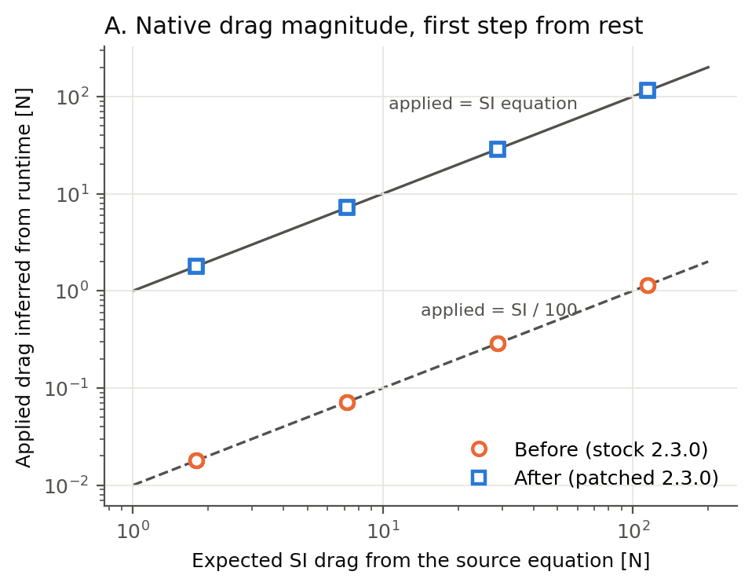
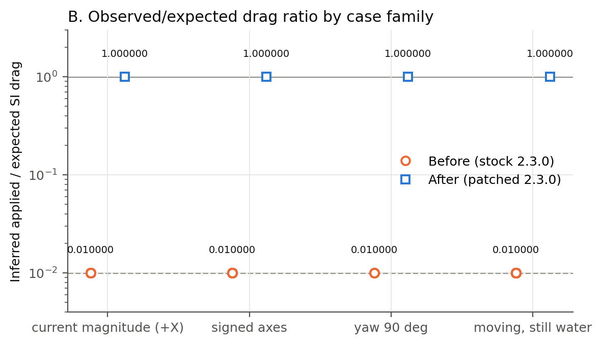
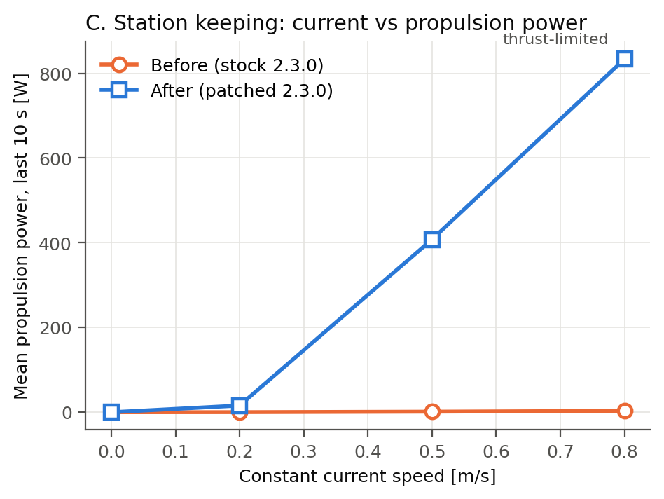
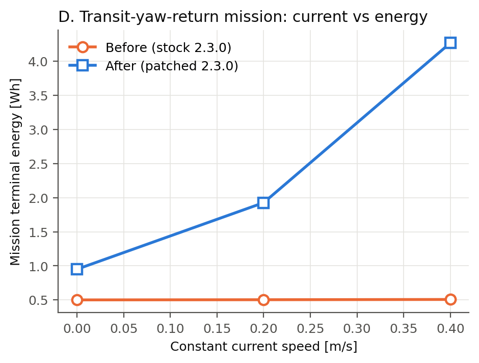
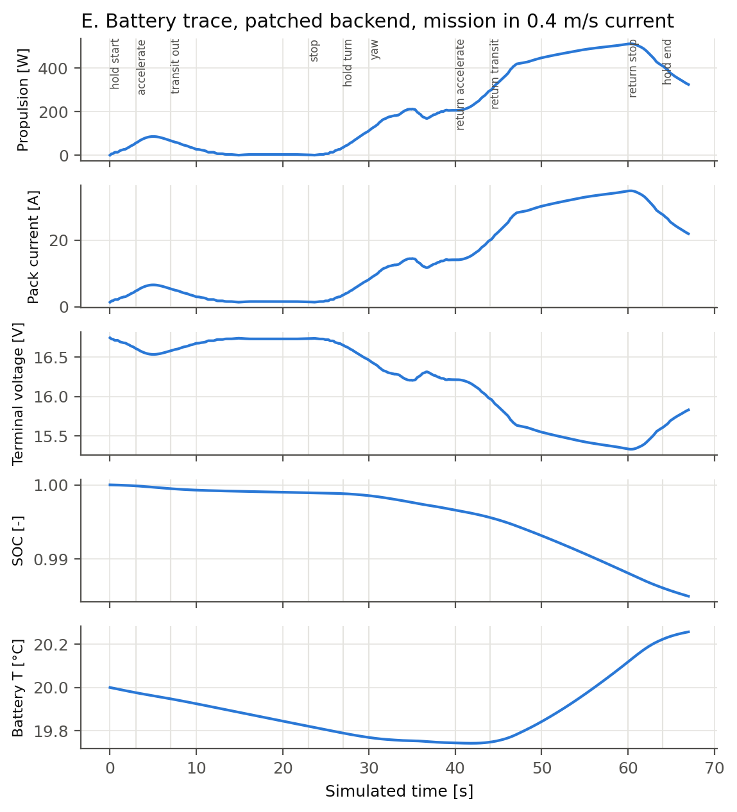

# Report: backend HoloOcean verificato per HoloEnergy

Data: 7–8 ottobre 2026. Repository `AndreaBedei1/HoloVirtualBattery`, branch
`fix/verified-holoocean-drag-backend`. **Ambito: verifica dell'implementazione
fisica del simulatore e del suo accoppiamento con HoloEnergy. Nessuna validazione
del BlueROV2 reale; nessun dato fisico è stato prodotto o simulato come tale.**

Il contributo principale del progetto resta HoloEnergy, *a generic configurable
energy-aware simulation framework for marine robots that couples vehicle dynamics,
actuator effort, electrical loads, electro-thermal battery behaviour and available
vehicle performance*. Il BlueROV2 è destinato a diventare la prima piattaforma di
riferimento calibrata e validata sperimentalmente. La correzione di HoloOcean è un
contributo secondario di verifica del simulatore, emerso nel predisporre un backend
fisicamente coerente; i risultati di HoloEnergy non dipendono da essa per essere
significativi.

## Risultato in breve

| Domanda | Risposta | Evidenza |
| --- | --- | --- |
| La patch di una riga corregge il drag a runtime? | **Sì**: applicato/atteso `1.0000000074` (153 casi), `1.0000001686` per veicolo in moto in acqua ferma (117 casi), contro `0.0099999997` del binario ufficiale | §10–§17 |
| La ricompilazione introduce differenze proprie? | **No**: build di controllo non patchata con dati bit-identici al binario ufficiale | §9, §10 |
| Spinte, gravità, galleggiamento cambiano? | **No**: bit-identici fra controllo e build patchata in tutti i casi senza drag | §14–§16 |
| 20 Hz è utilizzabile? | **No**: UE 5.3 integra al massimo 1/30 s per tick (fisica/clock = 0.6666667); coerente da 30 a 200 Hz | §18 |
| Frequenza scelta | **100 Hz**, dai dati: passo verificato, errore di passo contenuto, raffinamento a 200 Hz ≤ 0.04% sull'energia | §19 |
| Catena equazione → unità SI → forza Unreal → accelerazione → sforzo → domanda elettrica | **Chiusa tick per tick in anello chiuso** (station keeping e missione) sulla build patchata | §24 |
| Il backend ufficiale è riconoscibile? | `python tools/check_holoocean_backend.py` sul package installato: `FAIL: detected ~0.01 drag scaling associated with unpatched HoloOcean 2.3.0`; build patchata: `PASS` | §10, §11 |
| Suite nativa | 29/29 PASS (`sources/verified_backend/native_suite.json`) | §28 |

La catena richiesta come criterio di completamento è dimostrata con dati
riproducibili:

```text
equazione HoloOcean (literal del sorgente)                         §5, §6
  ↓  unità SI corrette (N), conversione N → kg·cm/s² della patch   §6, §11–§13
  ↓  forza Unreal corretta (rapporto 1.0000000 ± 1e-7)              §11–§17
  ↓  accelerazione runtime corretta (Δv del centro di massa)        §17, §24
  ↓  sforzo degli attuatori (azione applicata da HoloEnergy)        §20–§24
  ↓  domanda elettrica HoloEnergy (tabelle T200, tensione di bus)   §24
```

## Indice

1–9 build e provenienza · 10–17 drag before/after e regressioni · 18–19 passo
temporale e frequenza · 20–23 esperimenti energetici · 24–27 regressioni HoloEnergy,
dashboard e figure · 28–29 test e CI · 30–31 claim · 32–33 upstream ·
34 validazione fisica futura · 35–37 commit, push, blocchi · appendice: audit
critico.

## 1. Stato iniziale

Branch di partenza `investigation/holoocean-drag-units` a `07deed7`, pulito e
allineato a `origin`. Framework generico su `feature/generic-marine-energy-framework`
(`62c18cf`); tag `v0.1.0` su `a7a962b` (oggetto tag `fdcd7ee`): non toccati.
Analizzati: report e draft del drag, patch e relativo README, tooling
(`tools/audit_holoocean_drag.py`, `examples/verify_holoocean_drag_units.py`),
archivio `sources/holoocean_drag_audit/`, report del framework generico,
`docs/verification.md` e `docs/scientific_sources.md`. Dal lavoro precedente: CASE C
con rapporto 0.0099999997 su 153 casi; gravity, buoyancy e thruster coerenti a
60/100/200 Hz; conflitto clock/fisica a 20 Hz; patch preparata ma non compilata.

## 2. Branch

`fix/verified-holoocean-drag-backend`, creato da `07deed7`. Nessun force push,
nessuna riscrittura di storia, nessun tag creato o spostato; `v0.1.0` resta la
baseline stabile.

## 3. Ambiente di build

Windows 11 (10.0.26200), i7-12700H (14 core/20 thread), 15.7 GB RAM, RTX 3050
Laptop, un solo volume C: (72 GB liberi all'inizio, ~20 GB dopo la build).
Presenti: VS Community 2026 (senza MSVC), **VS 2022 Build Tools 17.14 con MSVC
14.44.35207** (elencati da vswhere solo con `-products *`), Windows SDK 10.0.22621.0
e 10.0.26100.0, .NET SDK 10. Nessun Unreal Engine né Epic Games Launcher: UE 5.3.2
è stato compilato da sorgente (account GitHub collegato a Epic, accesso in lettura a
`EpicGames/UnrealEngine`). Nessun software di sistema installato, disinstallato o
modificato. Effetto collaterale documentato in
[holoocean_patched_build.md](holoocean_patched_build.md): il primo avvio di .NET 6
da parte di UnrealBuildTool crea un certificato di sviluppo ASP.NET non attendibile
nello store utente.

## 4. Unreal Engine

UE **5.3.2**, tag `5.3.2-release`, commit `072300df18a94f18077ca20a14224b5d99fee872`,
clone superficiale in `C:\UE532`, GitDependencies solo Win64 (20.5 GB invece di
60.9 GB). Il binario ufficiale riporta `++UE5+Release-5.3-CL-29314046` (build
Launcher della stessa release). Due correzioni solo sintattiche negli header engine
per MSVC 14.44 (`ConcurrentLinearAllocator.h`: `__has_feature` annidato;
`D3D12CommandContext.h`: disambiguatore `template`), applicate dallo script dopo
verifica degli hash prima/dopo.

## 5. Sorgente HoloOcean

Tag `v2.3.0`, commit `49e70552dfd97273b7dfbe755fbe65d7738b24b7`, clonato con
`core.autocrlf=false`; il file del drag coincide byte per byte con quello analizzato
il 6 ottobre (SHA256 `580ce38b…`). Il repository upstream è privato (accesso utente
in sola lettura); i world Ocean non sono pubblici e sono stati riusati dal package
ufficiale installato (contenuti cooked, solo hard link/copie, mai modificati).

## 6. Patch utilizzata

[`patches/holoocean-2.3-drag-units.patch`](../patches/holoocean-2.3-drag-units.patch),
SHA256 `00f1b30383f4f40544a44c8660b84c4ade31c25bf6409b0d662a21728ab488fa`,
invariata rispetto al lavoro precedente: una riga `DragForce *= UEUnitsPerMeter;`
dopo l'equazione SI, senza riflessione degli assi (la velocità relativa è già in
assi UE). Documentazione per gli utenti: [patches/README.md](../patches/README.md)
(versione affetta, bug, evidenza, applicazione, revert, build, verifica, upstream).

## 7. Procedura di build

[docs/holoocean_patched_build.md](holoocean_patched_build.md), automatizzata da
`tools/build_patched_holoocean.py` (passi `engine` → `source` → `build` →
`assemble` → `manifest`): albero unico, prima il controllo non patchato, poi patch
e build incrementale (ricompila la sola unità del drag), output copiati e albero
ripristinato; package separati in `C:\HOB\packages\` con hard link ai contenuti
cooked ufficiali. Toolchain del binario ufficiale ricavato dal suo PDB: MSVC
14.44.35207, SDK 10.0.22621.0, configurazione Development, plugin allineati al
manifest cooked (`-EnablePlugin=EOSShared`). Cinque tentativi documentati con log
in [build_attempts.json](../sources/verified_backend/build_provenance/build_attempts.json):
argomenti PowerShell, due incompatibilità sintattiche MSVC ≥ 14.38/14.40, plugin
EOSShared mancante, build finale.

## 8. Binario originale

`%LOCALAPPDATA%/holoocean/2.3.0/worlds/Ocean/Windows/Holodeck/Binaries/Win64/Holodeck.exe`,
SHA256 `8c206c9cc05c640fb2efea6bd43bda33c585536ab16a931c55780855e7602253`,
255 731 200 byte. Mai modificato; l'installazione originale, l'ambiente Python e
il sorgente originale sono intatti.

## 9. Binari ricostruiti

| Variante | SHA256 `Holodeck.exe` | Byte | File del drag | PDB SHA256 |
| --- | --- | ---: | --- | --- |
| rebuilt-before (controllo) | `f52999dee2b064c492ec610d3b7ac450d77293ec3108d2ec20f22c42b2d6b524` | 254 710 272 | `580ce38b…` (originale) | `e89ed016…` |
| patched-after | `4d6c2d46be8703758fbe4e9b62a99d4037aec0e220cca3a60b22b488d441684a` | 254 710 784 | `3876cccf…` (patchato) | `0d3196d9…` |

Manifest (toolchain, comando, ambiente, hash degli output e dei contenuti cooked
riusati, limiti): [`build_provenance/`](../sources/verified_backend/build_provenance).
Ogni esecuzione registra nella propria provenance binario, PDB, manifest e variante
effettivamente avviati (`tools/holoocean_backend.py`, launcher unico che replica i
parametri di `holoocean.make`).

## 10. Audit BEFORE

Campagna decisiva invariata rispetto al 6 ottobre (17 casi × 60/100/200 Hz × 3
ripetizioni = 153 casi, 8 passi, 1224 osservazioni; stessi scenari, input, parsing e
metrica), eseguita sul binario ufficiale tramite il launcher unificato: **CASE C**,
rapporto medio applicato/atteso `0.009999999703068724` (min `0.009999999188257584`,
max `0.01000000038952784`). Il file raw ha lo stesso SHA256 dell'archivio del 6
ottobre (`9e203224e8e7c3008708d8e767310e1f8ba9b881158d832d4008592a5e0ca25b`): il
nuovo percorso di avvio non altera nulla. `tools/check_holoocean_backend.py` sul
binario ufficiale (anche senza argomenti, sul package installato) stampa per ogni
prova il rapporto (0.0100 con corrente e in acqua ferma; passo fisico PASS a
100 Hz) e la riga finale
`FAIL: detected ~0.01 drag scaling associated with unpatched HoloOcean 2.3.0`;
uguale sulla build di controllo.

**Controllo.** La build ricostruita non patchata (`f52999de…`) produce dati
**bit-identici** al binario ufficiale (stesso SHA256 del raw, differenza massima di
velocità 0.0 su 1224 osservazioni) pur avendo engine compilato da sorgente con MSVC
14.44 anziché l'engine precompilato Epic. L'unica differenza fra controllo e build
patchata è quindi la riga della patch (stesso albero, una sola unità ricompilata):
ogni differenza AFTER − controllo è attribuibile alla correzione.

## 11. Audit AFTER

Stessa campagna sulla build patchata (`4d6c2d46…`), con il sorgente patchato come
riferimento (`explicit_drag_unit_conversion = true`, scala attesa 1): **CASE A**,
rapporto medio `1.0000000073866224` (min `0.9999999422554873`, max
`1.0000000702469598`), tutti i riferimenti assoluti verificati.
`check_holoocean_backend.py`: rapporti 1.000000 (corrente e acqua ferma), passo
fisico PASS, riga finale `PASS`.

## 12. Rapporto osservato/atteso

| Corrente m/s | Atteso N | Before N | Controllo N | After N | Before rapporto | After rapporto |
| ---: | ---: | ---: | ---: | ---: | ---: | ---: |
| 0.1 | 1.794600 | 0.017945999 | 0.017945999 | 1.794600013 | 0.0099999997 | 1.0000000074 |
| 0.2 | 7.178400 | 0.071783998 | 0.071783998 | 7.178400053 | 0.0099999997 | 1.0000000074 |
| 0.4 | 28.713600 | 0.287135991 | 0.287135991 | 28.713600212 | 0.0099999997 | 1.0000000074 |
| 0.8 | 114.854400 | 1.148543966 | 1.148543966 | 114.854400848 | 0.0099999997 | 1.0000000074 |

Media di 9 esecuzioni per riga (3 frequenze × 3 ripetizioni), forza applicata
inferita al primo passo da fermo con `F = m·(v1/(1 − c·dt) − v0)/dt` (Eulero di
Chaos seguito dallo smorzamento `c = 1 s⁻¹` del sorgente). Deviazioni standard e
valori a precisione piena in
[drag_before_after.csv](../sources/verified_backend/drag_before_after.csv);
figura A in §27.

Per famiglia di casi (rapporto medio al primo impulso / su ogni passo):

| Famiglia | Before (ufficiale = controllo) | After |
| --- | --- | --- |
| Correnti +X 0.1–0.8 m/s | 0.0099999997 / 0.0099999999 | 1.0000000074 / 1.0000000070 |
| Correnti ±X, ±Y, ±Z e veicolo ruotato di 90° | 0.0099999997 / 0.0099999999 | 1.0000000074 / 0.9999999868 |
| Veicolo in moto in acqua ferma (casi della campagna decisiva) | 0.0100001264 / 0.0100000006 | 1.0000002762 / 1.0000000259 |

## 13. Scaling quadratico

Rapporti F(0.2)/F(0.1), F(0.4)/F(0.2), F(0.8)/F(0.4) fra 3.99999999999982 e
4.00000000000018 in tutte le build e a tutte le frequenze: la legge quadratica non
cambia; cambia solo la scala assoluta.

## 14–16. Regressioni thruster, gravità, galleggiamento

| Build | Errore spinta 10 N X/Y/Z | Errore gravità 9.8 m/s² | Velocità max a corrente nulla, neutro | ω max | Collisioni |
| --- | ---: | ---: | ---: | ---: | --- |
| Ufficiale | 6.186e−7 N | 7.161e−7 m/s² | 0 | 5.6e−17 rad/s | nessuna |
| Controllo | 6.186e−7 N | 7.161e−7 m/s² | 0 | 5.6e−17 rad/s | nessuna |
| Patchata | 6.186e−7 N | 7.161e−7 m/s² | 0 | 5.6e−17 rad/s | nessuna |

Più forte dei singoli criteri: in tutti i casi senza drag al primo passo (spinte
X/Y/Z, gravità in aria, quiete neutra, corrente pari alla velocità del veicolo)
velocità e forza ricostruita del controllo e della build patchata sono
**bit-identiche** (|Δv| = |ΔF| = 0.0). La patch cambia solo il percorso del drag;
galleggiamento netto (neutralità a corrente nulla) e stabilità angolare invariati.

## 17. Autodrag (veicolo in moto, acqua ferma)

Campagna dedicata `--case-set autodrag`: corrente nulla, velocità iniziale imposta
con `set_physics_state` dopo un passo di priming a flusso relativo nullo;
0.2/0.4/0.8 m/s su +X, 0.4 m/s su −X, ±Y, ±Z e con veicolo ruotato di 90°, più i
riferimenti spinta 10 N, gravità e quiete neutra: 13 casi × 60/100/200 Hz × 3
ripetizioni = 117 casi, 8 passi. Il drag atteso di ogni passo usa la velocità
all'inizio del passo (Eulero esplicito), quindi ogni passo è un'osservazione
indipendente della scala.

| Build | Primi impulsi | Rapporto medio | min–max | Passi | Rapporto medio per passo | min–max |
| --- | ---: | ---: | --- | ---: | ---: | --- |
| Ufficiale | 81 | 0.0100001365 | 0.0099995103–0.0100021509 | 648 | 0.0099999930 | 0.0099975371–0.0100021509 |
| Controllo | 81 | 0.0100001365 | 0.0099995103–0.0100021509 | 648 | 0.0099999930 | 0.0099975371–0.0100021509 |
| Patchata | 81 | 1.0000001686 | 0.9999988339–1.0000010585 | 648 | 1.0000000180 | 0.9999976215–1.0000023993 |

La dispersione del binario ufficiale (±2·10⁻⁴ relativo) è la risoluzione float32
della velocità rispetto al Δv prodotto da un drag 100 volte troppo piccolo
(≈2.5·10⁻⁵ m/s per passo a 100 Hz contro un ulp di ≈3·10⁻⁸ m/s a 0.4 m/s). Errore
massimo fra velocità misurata e predizione del sorgente con la scala della build:
3.2·10⁻⁸ m/s (patchata), 4.5·10⁻⁸ m/s (ufficiale). Il drag frena il veicolo anche
durante i normali movimenti: la correzione riguarda ogni missione, non solo lo
station keeping.

**Test upstream riprodotto.** `client/tests/scenarios/test_currents.py::test_currents_underwater`
di HoloOcean si aspetta 0.06320982 m/s² per HoveringAUV in corrente di 1 m/s a 60 Hz.
Riprodotto con la stessa sequenza in Ocean/SimpleUnderwater
(`tools/reproduce_upstream_currents_test.py`): binario ufficiale 0.06320976 m/s² su
X, Y e Z (= 0.0100000000 × il valore SI; la costante upstream è 0.0100000099 × SI),
build patchata 6.32097578 m/s² (1.0000000104 × SI). La costante del test upstream
codifica quindi la scala 0.01 e va aggiornata insieme alla correzione (§33). Primo
riscontro runtime su un secondo agente (HoveringAUV: m = 31.02 kg, Cd = 0.8,
A = 0.5 m²).

## 18. Audit del passo temporale

Report completo: [holoocean_timestep_report.md](holoocean_timestep_report.md).
`tools/audit_holoocean_timestep.py`, solo nativo, quattro stimatori indipendenti
(gravità in aria, spinta nota, rapporto di smorzamento, cinematica) più il DeltaTime
del mondo dal sensore, 20/30/40/60/100/200 Hz × 3 ripetizioni, tutte e tre le build:

| tps | dt client s | dt fisico stimato s | fisica/client | Esito |
| ---: | ---: | ---: | ---: | --- |
| 20 | 0.050000 | 0.0333333 | **0.6666667** | divergente |
| 30 | 0.033333 | 0.0333333 | 1.0000001 | coerente |
| 40 | 0.025000 | 0.0250000 | 1.0000000 | coerente |
| 60 | 0.016667 | 0.0166667 | 1.0000000 | coerente |
| 100 | 0.010000 | 0.0100000 | 1.0000000 | coerente |
| 200 | 0.005000 | 0.0050000 | 1.0000001 | coerente |

Predizione senza fitting dal sorgente UE 5.3.2: `dt_fisico = min(1/tps, 1/30 s)`
(`FChaosScene::SetUpForFrame`, `MaxPhysicsDeltaTime = 1/30` di default, substepping
disattivato). Gli stimatori concordano entro ~1·10⁻⁸ relativo; scarto dalla
predizione ≤ 1.7·10⁻⁷. **Scenario B**: comportamento documentato di Unreal ma non
documentato né intercettato da HoloOcean (clock Python e DeltaTime del mondo
avanzano di 1/tps, la fisica di 1/30 s). La diagnostica drag a 20 Hz resta
INCONCLUSIVE su entrambe le build, come previsto: spinta 10 N → m·a 6.4444 N e
gravità −6.3156 m/s² identiche; drag apparente 0.006784 (ufficiale) e 0.6784
(patchata), cioè la scala della build moltiplicata per
`(dt_fisico/dt_client)·(1 − c·dt_fisico)/(1 − c·dt_client) = (2/3)·(29/30)/0.95 = 0.6784`.
La patch non tocca il passo temporale (risultati identici sulle tre build).

Con il drag corretto il passo esplicito conta anche numericamente. Decelerazione in
acqua ferma da 2.5 m/s (build patchata, `K/m = 15.6 m⁻¹`): a 20–30 Hz la velocità
si inverte in un passo (−0.726 m/s misurati e predetti, contro 1.061 m/s della
soluzione continua); a 100 Hz il primo passo è −15% rispetto alla soluzione
continua, a 200 Hz −3.9%. Il backend integra esattamente la propria equazione con
Eulero esplicito (|misurato − predizione| ≤ 1·10⁻⁷ m/s): limite numerico, non
difetto di implementazione.

## 19. Frequenza raccomandata del simulatore

**100 Hz** (`dt = 0.01 s`), scelta dai dati:

1. passo fisico = clock = DeltaTime del mondo (verificato), quindi
   `dt energia = dt client = dt fisico`;
2. 100 Hz è una delle tre frequenze della campagna drag, verificata su tutte le build;
3. `K·|v_rel|·dt/m ≤ 0.125` per le velocità relative di questo lavoro (≤ 0.8 m/s);
   inversione in un passo solo sopra 6.4 m/s (contro 1.9 m/s a 30 Hz);
4. raffinamento a 200 Hz: energia propulsiva station keeping 0.5 m/s 3.11578 Wh
   contro 3.11547 Wh (+0.01%), missione 0.2 m/s 1.48985 Wh contro 1.49038 Wh
   (−0.04%): 100 Hz è numericamente convergente per queste grandezze.

30–60 Hz restano corretti per il clock; 200 Hz è consigliabile per transitori a
velocità relative elevate. Gli esempi nativi usano 100 Hz di default e rifiutano un
passo energetico più lungo di 1/30 s prima di avviare il simulatore
(`examples/_common.py`, test in `tests/test_examples.py`).

## Metodo comune degli esperimenti energetici (§20–§23)

`examples/native_current_energy_study.py`, backend nativo **patchato** a **100 Hz**
(`dt energia = dt client = dt fisico`, verificato in §18), BlueROV2 scheme 0.
Corrente costante lungo X mondo applicata con l'API pubblica `set_ocean_currents`
tramite `env.energy.set_environment(current_mode="native")` (la modalità di default
`descriptive` si limita a etichettare la corrente: verificato e coperto da test).
Controller di esempio invariato rispetto a `examples/native_station_keeping.py` (PID
di posizione 20/15/5 con integrale limitato, PD d'assetto 5/2: guadagni dimostrativi
non calibrati), allocazione pseudo-inversa sulla geometria BlueROV2 del sorgente.
HoloEnergy con profilo BlueROV2 L1 (pack 4S 18 Ah, tabelle T200 del costruttore;
placeholder dichiarati e segnalati a ogni avvio per curva OCV, resistenza interna e
dipendenze dalla temperatura, convertitori, carico hotel e parametri termici),
`apply_derating_to_actions = true`: un
comando oltre il limite pubblico ±28.75 N del backend o oltre i limiti elettrici
viene scalato uniformemente e l'energia è calcolata sullo sforzo realmente applicato.
**Nessuna correzione di drag, corrente, sforzo, energia o curve T200.** Ogni run
registra per thruster sforzo richiesto/applicato e potenza, potenza totale, Wh,
tensione, corrente, SOC, temperatura batteria, fattore di derating, stato batteria,
durata e provenance completa (`sources/verified_backend/energy_patched/`: report,
tracce ogni 10 tick, metadata compressi, hash dei log per tick).

Con i coefficienti del simulatore (`ρ·Cd·A/2 = 179.46 N/(m/s)²`) la massima spinta
di surge dei quattro thruster inclinati (4 × 28.75 N × cos 45° = 81.3 N) eguaglia il
drag a 0.673 m/s: oltre, il veicolo simulato non può mantenere la posizione. Questo
dipende da Cd e area del simulatore, non misurati sul BlueROV2 reale.

## 20. Station keeping con corrente

30 s per caso; medie sugli ultimi 10 s (velocità, potenza), energie sull'intero run:

| Corrente m/s | Velocità coda m/s | Propulsione coda W | Wh propulsivi | Wh terminali | Perdite batteria Wh | V min | I picco A | SOC finale | T batteria finale °C | Stato |
| ---: | ---: | ---: | ---: | ---: | ---: | ---: | ---: | ---: | ---: | --- |
| 0.0 | 0.0000 | 0.000 | 0.00000 | 0.19537 | 0.00065 | 16.740 | 1.40 | 0.999352 | 19.758 | NORMAL |
| 0.2 | 0.0041 | 15.875 | 0.15771 | 0.35308 | 0.00219 | 16.677 | 3.01 | 0.998825 | 19.763 | NORMAL |
| 0.5 | 0.0312 | 408.000 | 3.11547 | 3.31084 | 0.25004 | 15.219 | 38.92 | 0.988200 | 20.491 | NORMAL |
| 0.8 | 0.1247 | 833.528 | 6.07631 | 6.27168 | 1.00140 | 14.255 | 60.00 | 0.975845 | 22.698 | POWER_LIMITED da 6.6 s |

* Catena monotona corrente → drag → sforzo → potenza → energia, senza fitting
  (figura C).
* 0.5 m/s: il PID di esempio non è ancora a regime a 30 s (sforzo per thruster
  inclinato 17.0 N a t = 30 s contro 15.86 N del bilancio stazionario); nella prova a
  60 s (§22) la coda scende a 15.72 N con deriva 0.003 m/s, coerente con il bilancio.
  Nessun derating (fattore 1.0).
* 0.8 m/s: il controller chiede fino a −53 N per thruster; si attivano sia il limite
  pubblico del backend sia il **limite di corrente del pack (60 A)**: stato
  POWER_LIMITED dal secondo 6.6, sforzo applicato 28.4 N per thruster (fattore
  applicato/richiesto fino a 0.536), 78% dei tick con richiesta oltre ±28.75 N. Il
  veicolo deriva a valle a 0.125 m/s, in accordo con il bilancio
  (0.8 − √(4·28.4·cos45°/179.46) = 0.131 m/s). Saturazione dichiarata, non nascosta.
* Stesse condizioni sul binario ufficiale (drag 0.01×): propulsione 0.00183 /
  0.01145 / 0.02663 Wh a 0.2 / 0.5 / 0.8 m/s, cioè 86, 272 e 228 volte meno della
  build patchata. Il rapporto non è 100 né costante (controller, tabelle T200 non
  lineari, saturazione): i risultati del backend ufficiale **non** si correggono
  moltiplicando per 100.

## 21. Missione di movimento

Piano riproducibile (`mission_plan`, 67 s): hold 3 s → accelerazione 4 s (rampa
coseno) → transito 16 s a 0.25 m/s lungo +X → stop 4 s → hold 3 s → yaw di 180° in
10 s → riaccelerazione e ritorno 16 s lungo −X → stop → hold 3 s; il riferimento
torna esattamente al punto di partenza. Corrente lungo +X mondo: andata a favore,
ritorno contro corrente.

| Corrente m/s | Wh propulsivi | Wh terminali | Errore max posizione m | V min | I picco A | SOC finale | Roll/pitch max | Ufficiale: Wh propulsivi |
| ---: | ---: | ---: | ---: | ---: | ---: | ---: | ---: | ---: |
| 0.0 | 0.51427 | 0.95059 | 0.537 | 16.584 | 5.04 | 0.996827 | 0.00057° | 0.06449 |
| 0.2 | 1.49038 | 1.92671 | 0.965 | 15.963 | 20.23 | 0.993414 | 0.00057° | 0.06719 |
| 0.4 | 3.83260 | 4.26893 | 1.176 | 15.333 | 34.86 | 0.984957 | 0.00057° | 0.07086 |

Energia terminale per fase a 0.4 m/s (patchata): ritorno controcorrente 2.098 Wh su
4.269, yaw 0.572 Wh, stop di ritorno 0.552 Wh, transito a favore 0.165 Wh. Sul
binario ufficiale le stesse fasi valgono 0.134, 0.069, 0.030, 0.124 Wh: la corrente
quasi non pesa. Nessuna saturazione né derating nelle missioni. Traccia batteria in
figura E; energia vs corrente in figura D.

**Demo before/after** (`examples/holoocean_before_after_demo.py`, missione a
0.4 m/s, stesso controller e stesso piano sulle due build):

| Grandezza | Before (2.3.0 ufficiale) | After (2.3.0 patchato) |
| --- | ---: | ---: |
| Drag di implementazione medio / picco N | 0.356 / 0.827 | 34.08 / 71.07 |
| Norma media dello sforzo (coda) N | 0.096 | 41.45 |
| Energia propulsiva Wh | 0.071 | 3.833 |
| Energia terminale Wh | 0.507 | 4.269 |
| Errore massimo di posizione m | 0.134 | 1.176 |
| SOC finale | 0.99832 | 0.98496 |

L'AFTER è una **simulazione corretta nell'implementazione** (il backend applica la
propria equazione), non una previsione validata del veicolo reale.

## 22. Temperatura dell'acqua

Station keeping a 0.5 m/s per 60 s con acqua a 5, 15, 25 °C (stessa dinamica: la
temperatura dell'acqua non è un ingresso di HoloOcean):

| Acqua °C | T batteria finale °C | Wh terminali | SOC finale | Perdite interne Wh |
| ---: | ---: | ---: | ---: | ---: |
| 5 | 19.767 | 6.27604 | 0.977770 | 0.419565 |
| 15 | 20.719 | 6.27604 | 0.977770 | 0.419565 |
| 25 | 21.670 | 6.27604 | 0.977770 | 0.419565 |

Il parametro ambientale si propaga al modello termico a un nodo (scambio
`k·(T_bat − T_acqua)`; temperatura finale lineare nella temperatura dell'acqua).
Le grandezze elettriche restano identiche perché il profilo BlueROV2 usa mappe
OCV(T)/R(T) identità, placeholder in attesa della caratterizzazione; il flag
`temperature_outside_calibration = true` lo dichiara a ogni tick. Nessuna
interpretazione hardware. Con mappe dipendenti dalla temperatura la stessa
propagazione modifica perdite e SOC (mostrato da `examples/generic_scenarios.py`
con una mappa sintetica dichiarata, §25).

## 23. Payload

Station keeping a 0.2 m/s per 30 s:

| Variante | Wh terminali | ΔSOC | Effetto |
| --- | ---: | ---: | --- |
| Base | 0.353083 | 0.001175 | — |
| + payload elettrico 18 W | 0.519688 | 0.001734 | elettrico: +0.16661 Wh ≈ 18 W × 30 s / 0.90 (convertitore); V min 16.677 → 16.627 V |
| Batteria a metà capacità | 0.353082 | 0.002350 | elettrico: stesso consumo, ΔSOC raddoppiato |
| Payload fisico dichiarato (2 kg, 1 L) | 0.353083 | 0.001175 | **nessuno**: HoloOcean nativo non espone massa/volume/drag del veicolo; il payload resta descrittivo e non è simulato |

Effetto elettrico ed effetto dinamico restano distinti: il secondo richiede un
backend o un asset che applichi davvero massa, galleggiamento e drag del payload.

## 24. Regressione HoloEnergy e chiusura della catena

**Chiusura tick per tick in anello chiuso** (`tools/verify_energy_chain.py`).
Su tracce registrate a ogni tick (`--trace-every 1`) di station keeping a 0.2, 0.5,
0.8 m/s (10 s) e della missione a 0.4 m/s (67 s), build patchata a 100 Hz, si
confronta per ogni passo:

* la forza netta ricavata dalla variazione di velocità del **centro di massa**
  (DynamicsSensor `UseCOM`) con il passo fisico verificato,
  `F = m·(v1/(1 − c·dt) − v0)/dt`;
* la somma di (a) spinta dei thruster calcolata dagli **sforzi applicati da
  HoloEnergy**, geometria BlueROV2 del sorgente e assetto misurato, e (b) drag
  dell'**equazione del sorgente** alla velocità relativa di inizio passo, con la
  scala del sorgente compilato (1 per la build patchata);
* la potenza di ciascun thruster registrata da HoloEnergy con una ricostruzione
  **indipendente** dalle tabelle T200 del costruttore (interpolazione lineare in
  forza e poi in tensione, alla tensione di bus registrata), e l'energia propulsiva
  integrata sul passo verificato.

| Build | Run | Passi | Drag di picco N | Spinta di picco N | max \|residuo forza\| N | RMS residuo N | max \|Δ potenza thruster\| W | \|Δ energia\| relativo | Residuo assumendo drag SI N |
| --- | --- | ---: | ---: | ---: | ---: | ---: | ---: | ---: | ---: |
| Patchata (scala 1) | station 0.2 m/s | 999 | 9.04 | 9.34 | 8.0e−6 | 1.5e−6 | 4e−13 | 9e−16 | 8.0e−6 |
| Patchata (scala 1) | station 0.5 m/s | 999 | 53.39 | 54.11 | 2.9e−5 | 5.2e−6 | 3e−12 | 2e−16 | 2.9e−5 |
| Patchata (scala 1) | station 0.8 m/s | 999 | 88.22 | 80.69 | 5.2e−5 | 9.7e−6 | 4e−12 | 2e−16 | 5.2e−5 |
| Patchata (scala 1) | missione 0.4 m/s | 6699 | 71.07 | 73.73 | 3.3e−5 | 7.4e−6 | 4e−12 | 5e−15 | 3.3e−5 |
| Ufficiale (scala 0.01) | station 0.5 m/s | 999 | 0.46 | 0.51 | 9.5e−7 | 1.8e−7 | 2e−14 | 6e−16 | **45.1** |
| Ufficiale (scala 0.01) | missione 0.4 m/s | 6699 | 0.83 | 4.18 | 3.4e−5 | 9.7e−6 | 2e−13 | 1e−15 | **81.8** |

Il residuo di forza (≤ 5.2·10⁻⁵ N, cioè ≤ 6·10⁻⁷ del drag di picco) è al livello della
risoluzione float32 della velocità del sensore (`m·ulp(v)/dt ≈ 3.4·10⁻⁵ N` a
0.4 m/s e 100 Hz); include la manovra di yaw di 180°, la saturazione e il
limite di corrente a 0.8 m/s. I residui di potenza ed energia sono a precisione di
macchina. Le stesse tracce riproducono esattamente i risultati della campagna
energetica (missione a 0.4 m/s: 3.83260 Wh propulsivi, 4.26893 Wh terminali).
File: [`chain_patched/chain_closure.json`](../sources/verified_backend/chain_patched/chain_closure.json),
[`chain_original/chain_closure.json`](../sources/verified_backend/chain_original/chain_closure.json).

Nulla è stimato o adattato: massa, Cd, area, densità e smorzamento sono i literal
del sorgente; la geometria è quella del sorgente; le potenze vengono dalle tabelle
pubblicate. Lo stesso confronto sul binario ufficiale chiude solo con la scala 0.01
del sorgente non patchato; assumendo il drag SI il residuo diventa pari a ~99% del
drag (ultima colonna). La catena
`equazione → unità SI → forza Unreal → accelerazione → sforzo → domanda elettrica`
è quindi verificata quantitativamente nelle condizioni testate, non solo nei casi a
controller spento delle §10–§17.

**Derating** (`examples/verify_holoocean_integration.py --steps 300`, build
patchata, 100 Hz): con un limite di prova di 8 A il fattore minimo sulle azioni è
0.4906, la corrente resta a 8.0 A e lo spostamento in surge scende da 1.553 m
(solo contabilità) a 1.050 m (derating applicato al backend); processi del motore
chiusi in entrambi i casi.

**Test unitari HoloEnergy**: invariati e verdi (§28); nessun modello numerico di
HoloEnergy è stato modificato in questo lavoro (solo esempi, tool e test).

## 25. Regressione veicoli generici

Configurazioni non HoloOcean eseguite senza modifiche
([generic_regression.log](../sources/verified_backend/generic/generic_regression.log)):

| Esempio | Configurazione | Risultato |
| --- | --- | --- |
| `my_vehicle_energy_demo.py` | MyCustomROV di default, 6 attuatori, 24 V | 0.355278 Wh |
| `my_vehicle_energy_demo.py` | `configs/custom_rov.yaml` | 0.400000 Wh |
| `my_vehicle_energy_demo.py` | `configs/generic_lightweight_rov.yaml`, 4 attuatori, 12 V | 0.222222 Wh |
| `my_vehicle_energy_demo.py` | `configs/generic_auv.yaml`, 1 attuatore, 24 V | 0.193056 Wh |
| `energy_demo.py` | BlueROV2, backend sintetico | T finale 19.932 °C |
| `generic_scenarios.py` | 7 scenari a pari sforzo (payload, batteria, acqua 4/25 °C) | verificati |
| `holoenergy.analysis.cli compare` | L0 vs L1, missione sintetica | 0.262686 / 0.263642 Wh |

Il framework resta generico: nessuna dipendenza da HoloOcean nei modelli, nessun
parametro BlueROV2 nel core.

## 26. Regressione dashboard

`examples/realtime_energy_demo.py` sulla build patchata, 100 Hz, corrente nativa
0.3 m/s, 6000 passi (60 s simulati in tempo reale) con limite di prova di 8 A tra il
30% e il 70% del run: 1454 messaggi di telemetria inviati, **0 persi**, fattore
minimo 0.3955, limite applicato al backend in ogni passo
([realtime_report.json](../sources/verified_backend/dashboard_patched/realtime_report.json)).
Verificata nel browser integrato (`http://127.0.0.1:8765`): telemetria live, corrente
globale `0.30, 0.00, 0.00` m/s, fase `power_limit` con stato `POWER_LIMITED`, 8.0 A e
norma dello sforzo 15.8 N contro 40 N, storico di SOC/V/I/potenze, tabella attuatori
con comando −20 N e applicato −7.98 N, chiusura con `Mission ended` a 60.0 s;
nessun errore in console. Nessuna modifica alla dashboard era necessaria.

## 27. Figure

In [`docs/figures/verified_backend/`](figures/verified_backend), ciascuna in PNG,
SVG e PDF con il CSV da cui è disegnata; generate da
`tools/plot_verified_backend.py` a partire dai report archiviati:

| Figura | Contenuto | Fonte |
| --- | --- | --- |
| A | Drag atteso vs applicato, prima/dopo (log-log, rette 1 e 1/100) | `drag_original`, `drag_patched` |
| B | Rapporto applicato/atteso per famiglia di casi | campagne drag e autodrag |
| C | Corrente vs potenza propulsiva in station keeping | `energy_original`, `energy_patched` |
| D | Corrente vs energia della missione | idem |
| E | Traccia batteria (potenza, corrente, tensione, SOC, temperatura) della missione a 0.4 m/s | `energy_patched/mission_0.4.trace.jsonl.gz` |







## 28. Risultati dei test

| Controllo | Ambiente | Esito |
| --- | --- | --- |
| `pytest -q` | `.venv`, Python 3.13.12 (Windows) | **221 passed, 1 skipped** (NumPy assente: test dello studio nativo con NumPy) |
| `pytest -q` | ambiente HoloOcean, Python 3.10.20 | **221 passed, 1 skipped** (avvio del simulatore installato escluso dai test unitari per costruzione); 2 warning attesi di parametri non calibrati |
| `ruff check holoenergy examples tools tests` | Python 3.13 | nessun problema |
| `ruff format --check holoenergy examples tools tests` | Python 3.13 | 81 file già formattati |
| `uv build` | uv 0.11.7 | `holoenergy-0.1.0` wheel e sdist costruiti |
| wheel installato (`tools/check_installed_wheel.py`) | venv pulito, Python 3.13 | verificato |
| `uv lock --check` | — | lockfile coerente |

Nuovi test di questo lavoro (fixture sintetiche e, per la rianalisi, l'archivio reale;
nessun avvio del simulatore): passo temporale
e rianalisi dei dati archiviati senza sorgente HoloOcean
(`tests/test_timestep_audit.py`), check del backend (`tests/test_backend_check.py`),
build patchata (`tests/test_patched_build.py`), driver dell'audit drag
(`tests/test_drag_audit_driver.py`), studio nativo e corrente nativa
(`tests/test_native_study_tooling.py`), run sperimentali
(`tests/test_experiment_runs.py`), archivio e verdetti della suite
(`tests/test_archive_verified_backend.py`), chiusura della catena ed equivalenza della
ricostruzione T200 con il modello HoloEnergy (`tests/test_energy_chain.py`), rifiuto di
passi nativi > 1/30 s (`tests/test_examples.py`).

**Suite nativa** (simulatore reale, separata dai test unitari che non avviano
HoloOcean): [`native_suite.json`](../sources/verified_backend/native_suite.json),
generata da `tools/archive_verified_backend.py` con criterio quantitativo, valori
misurati ed esito per voce: drag BEFORE, controllo, drag AFTER, spinta, gravità,
neutralità, stabilità angolare, collisioni, scaling quadratico, assi/segni/yaw,
autodrag, passo temporale (tre build), check del backend (tre build), station
keeping, missione, raffinamento 100 → 200 Hz, chiusura della catena in anello
chiuso (§24), derating, dashboard, test upstream HoveringAUV, script di
riproduzione minimo, demo before/after, regressione generica, riga di esito del
check finale, chiusura pulita (nessun processo Holodeck residuo, exit code attesi).
**29/29 PASS**.
Esecuzioni con codice di uscita ≠ 0 *previsto* (non nascosto): check del backend
ufficiale e del controllo (FAIL per costruzione) e diagnostica a 20 Hz
(INCONCLUSIVE). Tutte elencate in `clean_shutdown.json`.

## 29. CI

Workflow `package checks` (`.github/workflows/ci.yml`): Ubuntu e Windows × Python
3.10–3.13; test unitari senza simulatore, ruff check/format, riproduzione
dell'import T200, build di wheel e sdist, verifica del wheel installato.

Stato al momento di questo commit: il branch non è mai stato pubblicato, quindi la
CI non ha ancora girato su di esso; l'esito sul branch pubblicato è registrato qui
dopo il push.

## 30. Claim scientifici ora supportati

* Il sorgente HoloOcean 2.3.0 (`v2.3.0`, `49e70552`) passa il drag del veicolo in
  newton a un'API di forza in kg·cm/s²; il binario ufficiale applica 0.0100 volte
  la propria equazione SI (153 casi con corrente, 117 con veicolo in moto in acqua
  ferma, riproduzione del test upstream su HoveringAUV).
* Una ricompilazione di controllo dallo stesso tag, con la toolchain del binario
  ufficiale, produce dati bit-identici al binario ufficiale nelle campagne campionate.
* Con la sola riga `DragForce *= UEUnitsPerMeter;` il backend applica la propria
  equazione SI (1.0000000 ± 1·10⁻⁷) per correnti ±X/±Y/±Z, veicolo ruotato e veicolo
  in moto, con legge quadratica conservata; spinte, gravità, galleggiamento netto,
  stabilità angolare e assenza di collisioni sono bit-identiche al controllo.
* Il passo fisico integrato è `min(1/tps, 1/30 s)`: coerente con il clock per
  tps ≥ 30 (verificato 30–200 Hz), 2/3 del clock a 20 Hz.
* Sul backend corretto a 100 Hz la catena equazione → unità SI → forza Unreal →
  accelerazione → sforzo applicato → domanda elettrica HoloEnergy è chiusa tick per
  tick in anello chiuso nelle condizioni testate; la potenza propulsiva cresce
  monotonamente con la corrente e i limiti elettrici (8 A di prova, 60 A del pack)
  limitano effettivamente la dinamica.
* HoloEnergy rileva il backend non corretto (`check_holoocean_backend.py`) senza
  compensarlo.

## 31. Claim ancora non supportati

* Accuratezza idrodinamica del BlueROV2: Cd = 0.8 e A = 0.45 m² sono parametri del
  simulatore, non misure; added mass, termini di Coriolis, smorzamento lineare,
  effetti di Reynolds e interazione thruster–scafo non sono modellati.
* Energia, endurance e temperatura della batteria del veicolo reale: profili con
  placeholder (curva OCV, resistenza interna e loro dipendenza dalla temperatura,
  modello termico, carico hotel, convertitori) e curve T200 statiche (bollard),
  senza effetti di inflow; nessun esperimento fisico.
* Correttezza a runtime di altri agenti (TorpedoAUV, CougUV, SurfaceVessel,
  FixedWing; HoveringAUV solo nel test upstream), del modello Fossen, del ramo
  `develop` e di versioni diverse dalla 2.3.0; build Linux.
* Effetti dinamici del payload fisico (HoloOcean nativo non espone massa/volume).
* Identità esatta del commit sorgente del binario ufficiale (coincidono toolchain e
  comportamento campionato).
* Qualunque affermazione su prestazioni reali del BlueROV2: l'AFTER è una
  simulazione corretta nell'implementazione, non validata sul mondo reale.

## 32. Commento upstream

Testo definitivo, **non pubblicato**, in
[holoocean_drag_issue_draft.md](holoocean_drag_issue_draft.md): commento alla issue
esistente [byu-holoocean/HoloOcean#368](https://github.com/byu-holoocean/HoloOcean/issues/368)
("Question - Unit Ocean Currents", aperta; un maintainer ha già indicato un probabile
bug il 2026-08-05) anziché una nuova issue duplicata. Contiene causa, correzione,
verifica con build di controllo e build patchata, tabella before/after, test
upstream che codifica la scala 0.01, nota separata sul passo fisico sotto i 30 Hz,
limiti dichiarati e link ai dati. Lo script di riproduzione minimo incluso è stato
eseguito così com'è su entrambi i binari
([minimal_repro.json](../sources/verified_backend/minimal_repro.json)).

## 33. Stato della PR upstream

**Non aperta.** Preparata in [holoocean_drag_issue_draft.md](holoocean_drag_issue_draft.md):
titolo `Fix native buoyant-agent drag force unit conversion`, base `develop`. Il diff
esatto è [`patches/holoocean-develop-drag-units.patch`](../patches/holoocean-develop-drag-units.patch)
(contro `f3d1230c`, recuperato in sola lettura il 2026-10-08): la stessa riga nei tre
percorsi del drag di `develop` (`ApplySurfaceBuoyancy`, `ApplyUnderwaterBuoyancy`,
`ApplyWavelessForces`) e l'aspettativa di `test_currents_underwater`
0.06320982 → 6.320976 m/s²; nessun refactor, nessun codice HoloEnergy. Si applica e si
inverte senza conflitti, ma **non è stato compilato né eseguito** su `develop`.
Prima di aprire la PR vanno rigenerati i valori empirici di `test_currents_surface`
(SurfaceVessel, 0.00679156/0.00680996 m/s²), che includono anch'essi il drag del
veicolo e richiedono il package TestWorlds, non disponibile qui. Stato del
repository upstream al 2026-10-07
([upstream_status.json](../sources/verified_backend/upstream_status.json)): privato,
permesso dell'utente solo `pull`, fork consentito, ultima release v2.3.0. Aprire la
PR richiede un fork e l'autorizzazione esplicita dell'autore.

## 34. Protocollo di validazione fisica futura

[validation_protocol_bluerov2.md](validation_protocol_bluerov2.md) (ordine dei 14
passi: elettronica/hotel, camera, sonar, DVL e altri sensori, convertitori,
caratterizzazione batteria, thruster in acqua, hover, surge, sway, yaw, verticale,
missioni di calibrazione, missioni held-out), con regole di sicurezza (mai attivare
il BlueROV2 fuori dall'acqua, mai thruster a secco, veicolo assicurato e personale
autorizzato), struttura [`experiments/`](../experiments/README.md) per run di
calibrazione e validazione, schema dei metadati e dei dati temporali, verifica con
`tools/check_experiment_run.py`, confronto L0 vs L1 vs reale con il tooling
esistente (`holoenergy.analysis.cli compare/evaluate`), studi di sensibilità solo
dopo la calibrazione. **Nessun dato reale è stato creato**; le fixture sintetiche
esistono solo nei test.

## 35. Commit

Tutti con autore Andrea Bedei, senza trailer di co-autore; nessun commit
riscritto, nessun tag creato o spostato. Dal punto di partenza `07deed7`:

| Commit | Messaggio |
| --- | --- |
| `881b5d6` | build: add reproducible patched HoloOcean workflow |
| `284c6d8` | test: extend native drag audit to separate builds and still-water drag |
| `4f39e3f` | test: add native HoloOcean physics timestep audit |
| `a29ffa7` | feat: add backend compatibility check |
| `a49f116` | experiment: add native current energy study, before/after demo and campaign runner |
| `aeeb84f` | feat: prepare structure and checks for real calibration and validation runs |
| `6f1c6e5` | fix: start the still-water drag stability analysis from the set state |
| `dff69b4` | test: reproduce HoloOcean's own currents test on HoveringAUV |
| `35965ec` | feat: optional native current in the realtime dashboard demo |
| `a777413` | test: archive the native campaign and summarize the native suite |
| `4c98aa1` | test: archive the verified-backend campaign and native suite results |
| `835c78d` | test: include the published minimal reproduction in the native suite |
| `91e6bc0` | docs: add verified-backend figures A-E with their source tables |
| `8829973` | test: close the drag-to-electrical-demand chain on closed-loop traces |
| `a0724d4` | test: archive the closed-loop chain closure and extend the native suite |

Seguono i commit di documentazione (report, passo temporale, compatibilità,
upstream, README); l'elenco completo è aggiornato qui dopo il push.

## 36. Push

Il branch non era mai stato pubblicato. Previsto: push ordinario (nessun force push)
di `fix/verified-holoocean-drag-backend` verso `origin`, verifica dell'HEAD remoto e
della CI; nessun tag. Esito registrato qui dopo il push.

## 37. Blocchi residui

* **Validazione fisica**: richiede il BlueROV2 in acqua, strumentazione V/I/T
  calibrata e personale autorizzato; nessun dato reale esiste ancora.
* **Pubblicazione upstream**: commento e PR pronti ma non pubblicati; servono
  l'autorizzazione esplicita dell'autore e, per la PR, un fork del repository
  privato, una build di `develop` con la patch e il package TestWorlds per
  rigenerare i valori di `test_currents_surface`.
* **Copertura del backend**: `develop`, altri agenti, Fossen, Linux e versioni
  future (2.4.x) non sono verificati; per ognuno va eseguito
  `tools/check_holoocean_backend.py` e, se serve, la campagna completa.
* **Parametri del veicolo**: Cd, area, added mass e curve T200 in avanzamento vanno
  identificati sul veicolo reale prima di qualunque claim quantitativo
  sull'endurance.
* **Release**: `v0.2.0` non creata (proposta sotto).

## Proposta di versione (non creata)

`v0.1.0` resta la baseline stabile. Proposta: **`v0.2.0`** dopo la revisione di
questo branch, perché aggiunge funzionalità compatibili (backend HoloOcean
selezionabile, check del backend, passo nativo verificato di default, studio
energetico con correnti native, chiusura della catena, struttura per la validazione
reale) e cambia un default visibile negli esempi nativi (100 Hz invece di 20 Hz,
rifiuto di passi > 1/30 s). Note di release suggerite: correzione HoloOcean come
patch opzionale documentata; risultati energetici con correnti solo su backend
verificato; nessun claim di validazione reale. Nessun tag è stato creato.

## Appendice: audit critico (lettura da revisore esterno)

**Riproducibilità.** Senza simulatore: rianalisi deterministica del passo
temporale (`--reanalyze`), suite nativa e figure dai file archiviati, chiusura della
catena dalle tracce archiviate, test unitari. Con il simulatore ufficiale: check del
backend, campagne drag/autodrag/timestep, script minimo. La ricostruzione del
binario patchato richiede accesso al repository HoloOcean (privato), UE 5.3.2 da
sorgente (account Epic collegato a GitHub), MSVC 14.44, ~40 GB di disco; tutto il
procedimento è scriptato e i cinque tentativi sono archiviati. I log energetici per
tick sono conservati solo come hash (dimensione); tracce ogni 10 tick e tracce per
tick della chiusura sono archiviate.

**Minacce alla validità e come sono trattate.**

1. *Metodo di ricostruzione della forza.* Dipende dall'ordine di integrazione di
   Chaos (Eulero, poi smorzamento). È validato con riferimenti indipendenti (spinta
   nota 10 N, gravità) a ogni frequenza e build (errori 6.2·10⁻⁷ N e
   7.2·10⁻⁷ m/s²) e, in anello chiuso, dalla chiusura per tick di §24.
2. *La ricostruzione cambia il binario?* Escluso per le grandezze campionate dal
   controllo bit-identico; non sono confrontati rendering e sensori visivi/acustici.
3. *Correzioni di compatibilità dell'engine.* Solo sintattiche (guardia del
   preprocessore, disambiguatore `template`), con hash prima/dopo; restano una
   deviazione dichiarata dall'engine 5.3.2 puro.
4. *Generalità.* Un solo world (SimpleUnderwater), un package (Ocean), un sistema
   operativo; BlueROV2 completo, HoveringAUV in un test. Gli altri agenti
   condividono il percorso del drag ma non sono stati eseguiti.
5. *Determinismo.* Il simulatore è deterministico nelle condizioni usate (ripetizioni
   identiche): le tre ripetizioni dimostrano il determinismo, non stimano una
   varianza; le incertezze sono di natura modellistica, non statistica.
6. *Dipendenza dai parametri del simulatore.* Le energie scalano con Cd·A
   (quadraticamente con la velocità relativa); sono coerenti con l'implementazione,
   non previsioni del veicolo reale.
7. *Controller.* Guadagni dimostrativi; transitori e wind-up dell'integrale (0.8 m/s)
   influenzano energia e derating. È una proprietà dell'esempio, dichiarata.
8. *Passo temporale.* Il cap 1/30 s è il default UE; una configurazione diversa
   cambierebbe il comportamento sotto i 30 Hz: il check del backend misura il passo
   e gli esempi rifiutano dt > 1/30 s.
9. *Ambito della patch.* Corregge la sola grandezza del drag del veicolo; non tocca
   coefficienti, idrodinamica di Fossen né altri difetti eventuali.
10. *Aspettative dei test upstream.* Il test upstream esistente codifica la scala
    0.01: la PR proposta cambia un'aspettativa e va motivata con l'analisi
    dimensionale e con l'indicazione del maintainer che le unità attese sono m/s;
    i valori empirici del test di superficie vanno rigenerati, non stimati.

**Esito dell'audit.** I claim di §30 sono sostenuti da evidenze riproducibili con
criteri quantitativi espliciti nei tool e nella suite; le soglie di classificazione
del drag e del passo temporale erano fissate nei tool prima delle campagne, quelle
riassuntive della suite sono state scritte dopo e sono riportate con i valori
grezzi. Le limitazioni di §31 sono esplicite e nessun risultato negativo è stato
rimosso (20 Hz resta rifiutato, i FAIL del backend ufficiale restano FAIL, il
payload fisico resta non simulato, i due falsi esiti trovati nella suite e nella
prima analisi di stabilità sono stati corretti nel codice e documentati).
